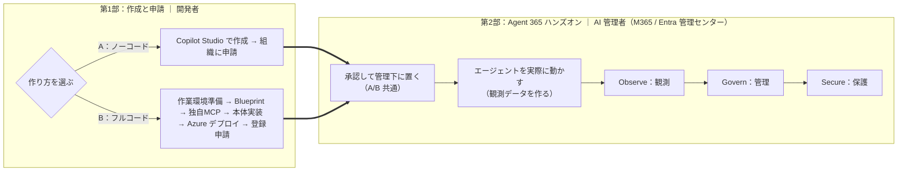

# Agent 365 ハンズオン 

**「 AI エージェント」を自分で作り、Agent 365 などの管理画面から管理できるようにするまで**を体験する、初学者向けの教材である。

この教材は、エージェントの**作り方を 2 ルート**用意している。どちらを選んでも、第2部で承認 → 観察（Observe）→ 管理（Govern）→ 保護（Secure）へ進む。

- **第1部 A：Copilot Studio で作る** — ノーコード／ローコードで最短。コードも Azure も不要。
- **第1部 B：独自エージェント＋独自 MCP を作る** — 自前ホストの LLM（Qwen）＋自作 MCP をフルコードで実装し Azure にデプロイ。

**第2部（AI 管理者・A/B 共通）** — 申請されたエージェントを承認して Teams に接続し、実際に動かして観測データを作り、Learn の 3 本柱 **Observe / Govern / Secure** で確認・統制・保護する。

> ⚠️ **教育目的の教材である。** 自前ホスト LLM・BYO MCP（クラウド公開）を含むため、本番環境では使用しないこと。使い終わったら後片づけ（`a365 cleanup` / リソース削除）を行うこと。

> ⚠️ **2026年7月現在、Microsoft Agent 365 は Preview を多く含む。** UI・コマンド・仕様・提供条件は変わり得る。実際のサービス活用にあたっては Microsoft Learn で最新情報を確認すること。

---

## 全体像（2 部構成）

本教材は「**第1部：環境構築**（作る）」→「**第2部：Agent 365 ハンズオン**（管理センター/Entra で確認・統制する）」の 2 部で進む。

| 部 | ゴール | 主な担当・画面 |
|----|--------|---------------|
| 第1部 作成と申請（A/B の 2 ルート） | エージェントを作って Agent 365 に登録申請（A: Copilot Studio ／ B: 独自＋独自MCP） | 開発者：Copilot Studio ／ VS Code・Azure |
| 第2部 Agent 365 ハンズオン | エージェントを承認し、機能 3 本柱（**Observe / Govern / Secure**）で登録内容・アクティビティ・ガバナンスを実機確認 | AI 管理者：M365 管理センター・Entra・Purview・Defender |

---

## 前提条件

| 項目 | 内容 | 対象ルート | ライセンス / 要件 |
|------|------|---------|------------------|
| Microsoft Agent 365 テナント | エージェント登録・観測・ガバナンスの基盤 | **A・B** | **Microsoft Agent 365** または **Microsoft 365 E7** |
| Copilot Studio ライセンス | Copilot Studio でエージェントを作成・公開する | **A** | **Microsoft 365 Copilot に含まれる**（一般的）。単体の Copilot Studio ライセンス・試用でも可 |
| Azure サブスクリプション | App Service（+ ACR / Functions）で自前ホスト。outbound HTTPS 必須 | **B** | 従量課金（本トレーニング期間のみの利用であれば数ドル程度） |
| 開発ツール | Node.js 18+ / Python 3.11+ / a365 CLI / Azure CLI / Azure Functions Core Tools | **B** | 無料 |
| AI コーディングアシスタント | **GitHub Copilot** または **Claude Code** のいずれ。Agent 365 Skills を実行する“土台” | **B** | GitHub Copilot（無料枠あり）/ Claude Code |
| Agent 365 Skills | 上記アシスタントに読み込ませて雛形生成を自動化するスキル集 | **B** | 無料（`microsoft/agent365-skills`） |
| Frontier Preview（任意） | AI Teammate 機能に必要。**本教材は非 AI Teammate のためどちらも不要** | A・B | — |

### 操作に必要な権限とロール

作業ごとに必要なロールを、**開発者（第1部）** と **AI 管理者（第2部）** に分けて示す。すべてクラウドで行うため、いずれも必要。

**開発者（第1部）**

| 作業 | 対象ルート | 必要なロール | 補足 |
|------|---------|------------|------|
| Copilot Studio でエージェントを作成・組織に申請 | **A** | N/A | ライセンスを持つユーザであれば特別な権限は不要 |
| Blueprint / Agent ID 作成（`a365 setup all`） | **B** | **Application Administrator**（推奨・最小）/ Cloud Application Administrator / Global Administrator | テナント初回のみ管理者が `a365 setup requirements` を実行すれば、以降の開発者は引き継げる |
| 自作 MCP 登録（`register-external-mcp-server`） | **B** | **Application Administrator** 相当 |  |
| Azure へのデプロイ（App Service / ACR / Functions） | **B** | Azure RBAC: **Contributor**（リソース作成）/ **User Access Administrator**（RBAC 付与） |  |

**AI 管理者（第2部）**

| 作業 | 対象ルート | 必要なロール | 補足 |
|------|---------|------------|------|
| エージェント登録の承認（Agents › Requests） | A・B | **AI Administrator** または **Global Administrator** |  |
| 自作 MCP の承認（Tools › Requests） | B | **AI Administrator** または **Global Administrator** | 同意は組織全体に付与 |
| Agent Registry / Single Agent Map の閲覧 | A・B | **AI Administrator** または **Global Administrator** |  |
| Block / 削除 | A・B | **AI Administrator** | 一時停止（Block）と完全削除の違いに留意 |
| 条件付きアクセス（Agent ID 対象） | A・B | **Conditional Access Administrator** / Security Administrator | |

### 用語ミニ辞典

| 用語 | 意味 |
|------|------|
| **Blueprint** | エージェントの「テンプレート」。ここから Agent ID を発行する。これ自体は実体ではない |
| **Entra Agent ID** | エージェントに付与される Entra 上の ID（blueprint の `agentBlueprintId`）。Observability の突き合わせキーになる |
| **instance 化** | Blueprint（テンプレート）から実際に使えるエージェントの実体を払い出すこと。|
| **BYO MCP** | 自作の外部 MCP サーバーを Agent 365 に登録して使う仕組み |
| **Kill Switch** | 管理センターの Block。構成を保持したまま即時停止（Unblock で復帰） |

---

# 手順（第1部・第2部）

## 第1部：エージェントの作成と申請（開発者）

作り方を 2 つから選ぶ：

- **A：Copilot Studio で作る（ノーコード）** → [docs/part1a-copilot-studio.md](./docs/part1a-copilot-studio.md)
- **B：独自エージェント＋独自 MCP（フルコード）** → [docs/part1b-custom-agent.md](./docs/part1b-custom-agent.md)

## 第2部：承認・観察・管理・保護（AI 管理者）

まず承認と観測データ作成（作成ルートに対応する方）：

- **A：Copilot Studio 版** → [docs/part2-1a-copilotstudio.md](./docs/part2-1a-copilotstudio.md)
- **B：独自エージェント版** → [docs/part2-1b-custom.md](./docs/part2-1b-custom.md)

続いて 3 本柱（A/B 共通）：

- **Observe（観察）** → [docs/part2-2-observe.md](./docs/part2-2-observe.md)
- **Govern（管理）** → [docs/part2-3-govern.md](./docs/part2-3-govern.md)
- **Secure（保護）** → [docs/part2-4-secure.md](./docs/part2-4-secure.md)

---

## 参考リンク

**Agent 365**

- [Microsoft Agent 365 の概要（Observe / Govern / Secure）](https://learn.microsoft.com/ja-jp/microsoft-agent-365/overview)
- [Agent 365 Developer Docs](https://learn.microsoft.com/microsoft-agent-365/developer/)
- [ポリシーテンプレート](https://learn.microsoft.com/microsoft-agent-365/admin/policy-template)

**Microsoft 365 管理センター（ admin › エージェント管理）** 

- [レジストリ管理](https://learn.microsoft.com/microsoft-365/admin/manage/agent-registry) ｜ [申請の承認](https://learn.microsoft.com/microsoft-365/admin/manage/agent-requests) ｜ [Agent Map](https://learn.microsoft.com/microsoft-365/admin/manage/agent-map) ｜ [ツール（BYO MCP）](https://learn.microsoft.com/microsoft-365/admin/manage/manage-tools-for-agent) ｜ [ロールと権限](https://learn.microsoft.com/microsoft-365/admin/manage/agent-roles-perms)

**Entra（ID・アクセス）**

- [On-Behalf-Of フロー（Entra Agent ID）](https://learn.microsoft.com/entra/agent-id/agent-on-behalf-of-oauth-flow)
- [エージェント向け条件付きアクセス](https://learn.microsoft.com/entra/identity/conditional-access/agent-id)

**Purview / Defender**

- [Purview DSPM for AI（AI のアクティビティ監視）](https://learn.microsoft.com/purview/ai-microsoft-purview)
- [Defender Advanced Hunting（AgentsInfo テーブル）](https://learn.microsoft.com/defender-xdr/advanced-hunting-agentsinfo-table)

**リポジトリ / 参考教材**

- [microsoft/agent365-skills](https://github.com/microsoft/agent365-skills)
- [ninjyanaka/a365handson](https://github.com/ninjyanaka/a365handson)
