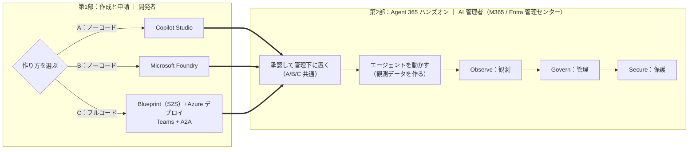

# Agent 365 ハンズオン 

**「 AI エージェント」を自分で作り、Agent 365 などの管理画面から管理できるようにするまで**を体験する、初学者向けの教材である。

この教材は、エージェントの**作り方を 3 ルート**用意している。どれを選んでも、第2部で承認 → 観察（Observe）→ 管理（Govern）→ 保護（Secure）へ進む。

- **第1部 A：Copilot Studio で作る** — ノーコードで最短。コードも Azure も不要。M365 業務寄りの汎用アシスタントに向く。
- **第1部 B：Microsoft Foundry で作る** — ノーコード。Foundry ポータルを用いて組織ニーズに応じたエージェントをカスタマイズ。
- **第1部 C：Teams + A2A 対応の独自エージェント（S2S）を作る** — 自前ホストの LLM（Qwen）をフルコード実装する。Teams入口はBot Appで認証し、Teams/A2Aの実行と観測は同じS2S Agent Identityへ結び付ける。

**第2部（AI 管理者・A/B/C 共通）** — 申請されたエージェントを承認して Teams に接続し、実際に動かして観測データを作り、Learn の 3 本柱 **Observe / Govern / Secure** で確認・統制・保護する。

> ⚠️ **教育目的の教材である。** 本番環境では使用しないこと。使い終わったら後片づけ（`a365 cleanup` / リソース削除）を行うこと。

> ⚠️ **2026年8月現在、Microsoft Agent 365 は Preview を多く含む。** UI・コマンド・仕様・提供条件は変わり得る。実際のサービス活用にあたっては Microsoft Learn で最新情報を確認すること。

---

## 全体像（2 部構成）

本教材は「**第1部：環境構築**（作る）」→「**第2部：Agent 365 ハンズオン**（管理センター/Entra で確認・統制する）」の 2 部で進む。

| 部 | ゴール | 主な担当・画面 |
|----|--------|---------------|
| 第1部 作成と申請（A/B/C の 3 ルート） | エージェントを作って Agent 365 に登録申請（A: Copilot Studio ／B: Microsoft Foundry ／C: 独自エージェント（S2S）） | 開発者：Copilot Studio ／ Foundry ／ VS Code・Azure |
| 第2部 Agent 365 ハンズオン | エージェントを承認し、機能 3 本柱（**Observe / Govern / Secure**）で登録内容・アクティビティ・ガバナンスの概要を実機確認 | AI 管理者：M365 管理センター・Entra・Purview・Defender |

---

# 手順（第1部・第2部）

## 第1部：エージェントの作成と申請（開発者）

作り方を 3 つから選ぶ：

- **A：Copilot Studio で作る（ノーコード）** → [docs/part1a-copilot-studio.md](./docs/part1a-copilot-studio.md)
- **B：Microsoft Foundry で作る（ノーコード）** → [docs/part1b-foundry.md](./docs/part1b-foundry.md)
- **C：Teams + A2A 対応の独自エージェント（S2S・フルコード）** → [docs/part1c-custom-agent.md](./docs/part1c-custom-agent.md)

## 第2部：承認・観察・管理・保護（AI 管理者）

承認と観測データ作成：

- **A：Copilot Studio 版** → [docs/part2-1a-copilotstudio.md](./docs/part2-1a-copilotstudio.md)
- **B：Microsoft Foundry 版** → [docs/part2-1b-foundry.md](./docs/part2-1b-foundry.md)
- **C：Teams + Copilot Studio A2A版** → [docs/part2-1c-custom.md](./docs/part2-1c-custom.md)

3 本柱（A/B/C 共通）：

- **Observe（観察）** → [docs/part2-2-observe.md](./docs/part2-2-observe.md)
- **Govern（管理）** → [docs/part2-3-govern.md](./docs/part2-3-govern.md)
- **Secure（保護）** → [docs/part2-4-secure.md](./docs/part2-4-secure.md)

---

## 付録：第3部（ボーナストラック）AI Teammate

**独自の M365 ユーザー ID（UPN・メールボックス・Teams 在席・組織図エントリ）を持つ AI Teammate** を作り、"人"としてふるまうエージェントの identity モデルと観測性（Activity）を体験する。

- **第3部 概要（認証モデル 2×2・リソース分離）** → [docs/part3-0-overview.md](./docs/part3-0-overview.md)
- **3-A：AI Teammate を作る（開発者）** → [docs/part3-1-ai-teammate.md](./docs/part3-1-ai-teammate.md)

---

## 前提条件

| 項目 | 内容 | 対象ルート | ライセンス / 要件 |
|------|------|---------|------------------|
| Microsoft Agent 365 テナント | エージェント登録・観測・ガバナンスの基盤| **A・B・C** | **Microsoft Agent 365** または **Microsoft 365 E7** |
| Copilot Studio ライセンス | Copilot Studioでエージェントを作成し、CルートではA2A呼び出し元も作成する | **A・C** | Microsoft 365 Copilot または 単体の Copilot Studio ライセンス |
| Microsoft Entra Internet Access | CルートのObserveで、Copilot Studioから独自エージェントへのA2A通信をGSA Traffic logsで確認する | **C**（GSA確認時のみ） | **Microsoft Entra Internet Access**（Microsoft Entra Suiteに含む、または単体ライセンス） |
| Microsoft Teams ライセンス | 公開したエージェントを Teams で使う（作成者・利用者の双方） | **A・B・C** | Teams ライセンス・Microsoft 365 Copilot |
| Azure サブスクリプション（Foundry プロジェクト用） | Microsoft Foundry のプロジェクトを作成する。ポータル操作のみで完結し、Docker・コードは不要 | **B** | 従量課金（モデル呼び出し・ツール利用分のみ） |
| Azure サブスクリプション（App Service 等） | App Service（+ ACR / Functions）でホスト | **C** | 従量課金（本トレーニング期間のみの利用であれば数ドル程度） |
| 開発ツール | Node.js 18+ / Python 3.11+ / a365 CLI / Azure CLI / Azure Functions Core Tools | **C** | 無料 |
| AI コーディングアシスタント | **GitHub Copilot** または **Claude Code** のいずれ。Agent 365 Skills を実行する“土台” | **C** | GitHub Copilot（無料枠あり）/ Claude Code |
| Agent 365 Skills | 上記アシスタントに読み込ませて雛形生成を自動化するスキル集 | **C** | 無料（`microsoft/agent365-skills`） |

### 操作に必要な権限とロール

作業ごとに必要なロールを、**開発者（第1部）** と **AI 管理者（第2部）** に分けて示す。

**開発者（第1部）**

| 作業 | 対象ルート | 必要なロール | 補足 |
|------|---------|------------|------|
| Copilot Studioでエージェントを作成・編集（CではA2A呼び出し元を作成） | **A・C** | N/A | 対象環境でエージェントを作成・接続できる権限が必要 |
| Foundry ポータルで Agent を作成・公開 | **B** | Foundry プロジェクトスコープの **Foundry User** または **Foundry Project Manager**（プロジェクト自体の初回作成には Azure RBAC の **Contributor** 等が別途必要） | コード・Azure CLI・Docker は不要。ポータル操作のみで完結 |
| Blueprint / Agent ID 作成（`a365 setup all`） | **C** | **Application Administrator**（推奨・最小）/ Cloud Application Administrator / Global Administrator | テナント初回のみ管理者が `a365 setup requirements` を実行すれば、以降の開発者は引き継げる |
| Azure へのデプロイ（App Service / ACR） | **C** | Azure RBAC: **Contributor**（リソース作成）/ **User Access Administrator**（RBAC 付与） |  |

**AI 管理者（第2部）**

| 作業 | 対象ルート | 必要なロール | 補足 |
|------|---------|------------|------|
| エージェント登録の承認（Agents › Requests） | A・B・C | **AI Administrator** または **Global Administrator** |  |
| Agent Registry / Single Agent Map の閲覧 | A・B・C | **AI Reader** 以上 |  |
| M365 管理センターで件数（Activity）を閲覧 | A・B・C | **AI Reader** 以上 | Activity タブ詳細の表示に **E7 または Agent 365** ライセンスが必要 |
| Entra サインインログ（Agent）を閲覧 | A・B・C |  **Reports Reader** 以上 |  |
| Purview DSPM  で対話本文（Prompt/Response）を閲覧 | A・B・C | Information Protection Investigators 相当（Data Classification Content Viewer を含む） |  |
| Defender 高度なハンティング（CloudAppEvents）を実行 | A・B・C | **Security Reader**（閲覧）/ Security Operator |  |
| Block / 削除 | A・B・C | **AI Administrator** | 一時停止（Block）と完全削除の違いに留意 |
| 条件付きアクセス（Agent ID 対象） | A・B・C | **Conditional Access Administrator** / Security Administrator | |
| カスタムポリシーテンプレートの前提ポリシー作成（Entra） | A・B・C | 条件付きアクセス：**Conditional Access Administrator** アクセスパッケージ：**Identity Governance Administrator** カスタムセキュリティ属性：**属性定義管理者**・**属性割り当て管理者** | 特に、**Global 管理者でもカスタムセキュリティ属性の権限は既定で持たない**ため別途付与が必要 |

---

## 参考リンク

**Agent 365**

- [Microsoft Agent 365 の概要（Observe / Govern / Secure）](https://learn.microsoft.com/ja-jp/microsoft-agent-365/overview)
- [Agent 365 Developer Docs](https://learn.microsoft.com/microsoft-agent-365/developer/)
- [ポリシーテンプレート](https://learn.microsoft.com/microsoft-agent-365/admin/policy-template)

**Microsoft 365 管理センター（ admin › エージェント管理）** 

- [レジストリ管理](https://learn.microsoft.com/microsoft-365/admin/manage/agent-registry) ｜ [申請の承認](https://learn.microsoft.com/microsoft-365/admin/manage/agent-requests) ｜ [Agent Map](https://learn.microsoft.com/microsoft-365/admin/manage/agent-map) ｜ [ツール（BYO MCP）](https://learn.microsoft.com/microsoft-365/admin/manage/manage-tools-for-agent) ｜ [ロールと権限](https://learn.microsoft.com/microsoft-365/admin/manage/agent-roles-perms)

**Entra（ID・アクセス）**

- [On-Behalf-Of フロー（Entra Agent ID）](https://learn.microsoft.com/entra/agent-id/agent-on-behalf-of-oauth-flow)
- [エージェント向け条件付きアクセス](https://learn.microsoft.com/entra/identity/conditional-access/agent-id)

**Purview / Defender**

- [Purview DSPM for AI（AI のアクティビティ監視）](https://learn.microsoft.com/purview/ai-microsoft-purview)
- [Defender Advanced Hunting（AgentsInfo テーブル）](https://learn.microsoft.com/defender-xdr/advanced-hunting-agentsinfo-table)

**リポジトリ / 参考教材**

- [microsoft/agent365-skills](https://github.com/microsoft/agent365-skills)
- [ninjyanaka/a365handson](https://github.com/ninjyanaka/a365handson)

---

## 注意事項

- **本教材は公式 Microsoft 製品ではなく**、Microsoft Agent 365 を学習するための非公式なサンプルである。
- **教育目的の教材である。本番環境では使用しないこと。** 使い終わったら後片づけ（`a365 cleanup` / リソース削除）を行い、意図しない課金やエージェントの残存を避けること。
- **2026年8月現在、Microsoft Agent 365 は Preview を多く含む。** UI・コマンド・仕様・提供条件・ライセンス要件は将来変更される可能性がある。最新情報は Microsoft Learn で確認すること。
- 手順内で参照するツール・CLI・拡張機能のバージョンは将来変更される可能性がある。

---

## ライセンス

[MIT License](LICENSE)
