# Agent 365 ハンズオン 

**「AI エージェント」を自分で作り、Agent 365 などの管理画面から管理できるようにするまで**を体験する、初学者向けの教材です。

この教材でやることは、大きく次の 5 ステップです。

1. **エージェントの“土台”を用意する** — 開発ツールをそろえ、Agent 365 の **Blueprint / Agent ID**（エージェントの ID と、アプリの骨格・接続情報）を作ります。
2. **エージェントが使う道具（MCP）を作る** — エージェントが活用するツール（本教材では `echo` / `now` といった疑似的なもの）を自作します。
3. **本体を実装してクラウドにデプロイする** — 応答ロジックを実装し、Azure に載せます。
4. **Agent 365 に登録して“管理下”に置く** — エージェントと道具（MCP）を登録し、管理者が承認します（管理画面で可視化されます）。
5. **管理者として統制する** — 管理者がエージェントを **ワンクリックで止める（Kill Switch）** など、ガバナンス（統制）が効くことを確認します。

> ⚠️ **教育目的の教材である。** 自前ホスト LLM・BYO MCP（クラウド公開）を含むため、本番環境では使用しないこと。使い終わったら後片づけ（`a365 cleanup` / リソース削除）を行うこと。

> ⚠️ **2026年7月現在、Microsoft Agent 365 は Preview を多く含む。** UI・コマンド・仕様・提供条件は変わり得る。実際のサービス活用にあたっては Microsoft Learn で最新情報を確認すること。

---

## 全体像（2 部構成）

本教材は「**第1部：環境構築**（作る）」→「**第2部：Agent 365 ハンズオン**（管理センター/Entra で確認・統制する）」の 2 部で進みます。

```mermaid
flowchart LR
    subgraph P1["第1部：環境構築 ｜ 開発者（VS Code / ターミナル）"]
        direction TB
        A1["作業端末への必要ツール導入"] --> A2["作業端末への便利ツール（Skills） 導入"] --> A3["Blueprint / Agent ID 作成"]
        A3 --> A4["自作 MCP サーバ作成<br/>(Azure Functions)"] --> A5["AI エージェント作成"]
        A5 --> A6["Azure への AI エージェントデプロイ"]
    end
    subgraph P2["第2部：Agent 365 ハンズオン ｜ AI 管理者（M365 / Entra 管理センター）"]
        direction TB
        B1["Ai エージェントの承認"] --> B2["Entra Agent ID 確認"]
        B2 --> B3["Agent Registry を確認"] --> B4["Single Agent Map で関係性の可視化"]
        B4 --> B5["ガバナンス制御"]
    end
    A6 ==> B1
```




| 部 | ゴール | 主な担当・画面 |
|----|--------|---------------|
| 第1部 環境構築 | エージェントが Agent 365 に登録され、Azure（クラウド）で動く | 開発者：VS Code・ターミナル・Azure |
| 第2部 Agent 365 ハンズオン | 登録内容・アクティビティ・ガバナンスを実機で確認できる | AI 管理者：M365 管理センター・Entra 管理センター |

---

## 前提条件

| 項目 | 内容 | ライセンス / 要件 |
|------|------|------------------|
| Microsoft Agent 365 テナント | エージェント登録・観測・ガバナンスの基盤 | **Microsoft Agent 365** または **Microsoft 365 E7** |
| Azure サブスクリプション | App Service（+ ACR / Functions）で自前ホスト。outbound HTTPS 必須 | 従量課金（本トレーニング期間のみの利用であれば数ドル程度） |
| 開発ツール | Node.js 18+ / Python 3.11+ / a365 CLI / Azure CLI / Azure Functions Core Tools | 無料 |
| Agent 365 Skills | Copilot / Claude Code 用の自動化スキル集 | 無料（`microsoft/agent365-skills`） |
| Frontier Preview（任意） | AI Teammate 機能に必要。**本教材は非 AI Teammate のため必須としない** | — |

### 操作に必要な権限とロール

作業ごとに必要なロールを、**開発者（第1部）** と **AI 管理者（第2部）** の担当で分けて示す。

| 作業 | 担当 | 必要なロール | 補足 |
|------|------|------------|------|
| Blueprint / Agent ID 作成（`a365 setup all`） | 開発者 | **Application Administrator**（推奨・最小）/ Cloud Application Administrator / Global Administrator | テナント初回のみ管理者が `a365 setup requirements` を実行すれば、以降の開発者は引き継げる |
| 自作 MCP 登録（`register-external-mcp-server`） | 開発者 |  **Application Administrator** 相当 |  |
| Azure へのデプロイ（App Service / ACR / Functions） | 開発者 | Azure RBAC: **Contributor**（リソース作成）/ **User Access Administrator**（RBAC 付与） |  |
| エージェント登録の承認（Agents › Requests） | AI 管理者 | **AI Administrator** または **Global Administrator** |  |
| 自作 MCP 登録の承認（Tools › Requests） | AI 管理者 | **AI Administrator** または **Global Administrator** | 組織全体に公開 |
| Agent Registry / Single Agent Map の閲覧 | AI 管理者 | **AI Administrator** または **Global Administrator** |  |
| Block/ 削除 | AI 管理者 | **AI Administrator** | 一時停止（Block）と完全削除の違いに留意 |
| 条件付きアクセス（Agent ID 対象） | AI 管理者 | **Conditional Access Administrator** / Security Administrator | |

### 構成ファイル

必要なファイルは **① 自作コード**、**② `a365 setup all` / Skills が自動生成するもの**、**③ シークレット** の 3 種に分かれる。
本リポジトリの [`src/`](./src) は ① に相当する。②・③ は各自の環境で生成されるためリポジトリには含まれない点に注意。

```text
<PROJECT_DIR>/
├── src/                             # ① 本リポジトリに同梱
│   ├── app.py                       #   AgentApplication 本体（on_message で LLM 呼び出し）
│   ├── llm.py                       #   OSS LLM（Ollama, OpenAI 互換）クライアント
│   ├── obo.py                       #   OBO トークン交換（jwt-bearer）
│   ├── observability_setup.py       #   Agent 365 Observability 配線（use_s2s_endpoint=False）
│   ├── function_app.py              #   BYO MCP サーバー（echo / now）
│   ├── requirements.txt             #   依存パッケージ
│   └── .env.example                 #   .env のテンプレ（実値は setup all がスタンプ）
├── start_server.py                  # ② Skills 生成：aiohttp ホスティング層
├── appPackage/manifest.json         # ② Skills 生成：公開用 manifest
├── a365.config.json                 # ② setup の入力 config（aiTeammate:false 等）
├── .env                             # ③ secret：a365 setup all がスタンプ（← .gitignore）
└── a365.generated.config.json       # ③ secret：setup 生成（blueprint ID/同意状況）← .gitignore
```
### 用語ミニ辞典

| 用語 | 意味 |
|------|------|
| **Blueprint** | エージェントの「テンプレート」。ここから Agent ID を発行する。これ自体は実体ではない |
| **Entra Agent ID** | エージェントに付与される Entra 上の ID。**instance 化して初めて実値になる** |
| **instance 化** | Blueprint（テンプレート）から、実際に使えるエージェントの実体を 1 つ払い出すこと。これで初めて Entra Agent ID が実値の GUID になり、利用可能になる |
| **BYO MCP** | 自作の外部 MCP サーバーを Agent 365 に登録して使う仕組み |
| **Kill Switch** | 管理センターの Block。構成を保持したまま即時停止（Unblock で復帰） |

---

# 手順（第1部・第2部）

詳細な手順は `docs/` に分割しています。まず下の概要をつかんでから、各パートのドキュメントに進んでください。

## 第1部：環境構築（開発者）　→ [docs/part1-setup.md](./docs/part1-setup.md)

ツール導入 → Skills 導入 → **Blueprint / Agent ID 作成** → **BYO MCP（Azure Functions）** → **アプリ実装（LLM / OBO / 観測）** → **Azure デプロイ & 登録**。
完了すると、エージェントが Agent 365 に登録され、Azure（クラウド）で動く。実装コードは [src/](./src) 参照。

## 第2部：Agent 365 ハンズオン（AI 管理者）　→ [docs/part2-handson.md](./docs/part2-handson.md)

**管理者承認（Requests）** → **Entra Agent ID 確認** → **Agent Registry 確認** → **Single Agent Map で可視化** → **ガバナンス（Block=Kill Switch / 条件付きアクセス / 削除）**。
Microsoft 365 管理センターと Entra 管理センターで、登録内容とガバナンスを実機で確認する。

---
---

# 付録

## 付録 A. 実装リファレンス（コード例）

> Preview 前提の実装スケルトン。着手時に現行 SDK / Learn で最終確認すること。

### A.1 LLM クライアント（`llm.py`）

```python
# llm.py — Ollama sidecar (OpenAI 互換) への接続。起動時ブロック回避のため lazy。
from openai import OpenAI, APIConnectionError
from os import environ
import time

_client: OpenAI | None = None

def get_llm() -> OpenAI:
    global _client
    if _client:
        return _client
    c = OpenAI(base_url=environ.get("OLLAMA_BASE_URL", "http://localhost:11434/v1"),
               api_key="ollama")
    for _ in range(60):                     # warmup を待つ（最大 60s）
        try:
            c.models.list(); _client = c; return c
        except APIConnectionError:
            time.sleep(1)
    raise RuntimeError("Ollama sidecar not ready")

SYSTEM_PROMPT = environ.get("SYSTEM_PROMPT",
    "あなたは日本語で簡潔に答えるアシスタントです。")

def chat_complete(user_text: str) -> str:
    r = get_llm().chat.completions.create(
        model=environ.get("OLLAMA_MODEL", "qwen2.5:3b-instruct-q4_K_M"),
        messages=[{"role": "system", "content": SYSTEM_PROMPT},
                  {"role": "user", "content": user_text}])
    return r.choices[0].message.content or ""
```

### A.2 メッセージ処理（`app.py`）

```python
# app.py（抜粋）— Skills 生成の AgentApplication に LLM を差し込む
from microsoft_agents.hosting.core import AgentApplication, MemoryStorage, TurnContext, TurnState
from start_server import build_adapter
from llm import chat_complete

AGENT_APP = AgentApplication[TurnState](storage=MemoryStorage(), adapter=build_adapter())

@AGENT_APP.message("/help")
async def _help(ctx: TurnContext, _: TurnState):
    await ctx.send_activity("Send any message to chat.")

@AGENT_APP.activity("message")
async def _on_message(ctx: TurnContext, _: TurnState):
    reply = chat_complete(ctx.activity.text or "")
    await ctx.send_activity(reply)
```

### A.3 OBO トークン交換 ＋ 観測配線（`obo.py` / `observability_setup.py`）

```python
# obo.py — 受け取ったユーザートークンを観測用スコープの OBO トークンに交換
import msal
from os import environ

_cca = msal.ConfidentialClientApplication(
    client_id=environ["CONNECTIONS__SERVICE_CONNECTION__SETTINGS__CLIENTID"],
    authority=f"https://login.microsoftonline.com/{environ['TENANT_ID']}",
    client_credential=environ.get("CLIENT_SECRET"),  # 本番は Managed Identity / FIC 推奨
)
OBS_SCOPE = ["api://<obs-app-id>/Agent365.Observability.OtelWrite"]

def exchange_obo(user_assertion: str) -> str | None:
    r = _cca.acquire_token_on_behalf_of(user_assertion=user_assertion, scopes=OBS_SCOPE)
    return r.get("access_token")
```

```python
# observability_setup.py（抜粋）— exporter を OBO エンドポイントへ
from microsoft_agents_a365.observability.core import configure
from microsoft_agents_a365.observability.core.exporters.agent365_exporter_options import (
    Agent365ExporterOptions)
from obo import exchange_obo

_current_user_token: dict[str, str] = {}   # request context から供給

def _token_resolver(agent_id: str, tenant_id: str) -> str | None:
    ua = _current_user_token.get("assertion")
    return exchange_obo(ua) if ua else None

configure(
    service_name="<AGENT_NAME>-runtime",
    service_namespace="ai.agents.selfhosted",
    exporter_options=Agent365ExporterOptions(
        token_resolver=_token_resolver,
        use_s2s_endpoint=False,     # ★OBO: /observability/… (agentic token cache)
    ),
)
```

### A.4 BYO MCP サーバー（`function_app.py`）

```python
# function_app.py — 学習用ダミーツール2個（echo / now）
# ※ Azure Functions の MCP tool trigger（Preview）。バインド仕様は現行 SDK で要確認。
import azure.functions as func
import datetime, json

app = func.FunctionApp()

_ECHO_PROPS = json.dumps([
    {"propertyName": "text", "propertyType": "string", "description": "echo する文字列"}
])

@app.generic_trigger(arg_name="context", type="mcpToolTrigger",
                     toolName="echo", description="入力をそのまま返す",
                     toolProperties=_ECHO_PROPS)
def echo(context) -> str:
    args = json.loads(context).get("arguments", {})
    return args.get("text", "")

@app.generic_trigger(arg_name="context", type="mcpToolTrigger",
                     toolName="now", description="現在の UTC 時刻を返す",
                     toolProperties="[]")
def now(context) -> str:
    return datetime.datetime.utcnow().isoformat() + "Z"
```

## 付録 B. よく使う a365 コマンド

| コマンド | 用途 |
|---|---|
| `a365 setup all` | 前提〜ID 発行〜`.env` スタンプ（冪等） |
| `a365 develop get-token` | 開発/テスト用トークン取得 |
| `a365 develop-mcp register-external-mcp-server` | 外部 MCP 登録 |
| `a365 query-entra` | Entra 登録状態の照会 |
| `a365 publish` | manifest.zip 生成（→ Requests に Pending review） |
| `a365 logs export` | 実行ログのエクスポート |
| `a365 cleanup` | 全 Agent 365 リソース削除（**破壊的**） |

## 付録 C. トラブルシュート早見

| 症状 | 確認 |
|---|---|
| 起動直後に再起動ループ | LLM を遅延初期化したか（warmup 前に `list()` を呼ぶな） |
| 観測が 401 リトライ | OBO 交換の scp・`use_s2s_endpoint=False` |
| Teams に届かない（AI Teammate 時） | `messagingEndpoint` が古い/別物（最頻出の罠） |
| MCP が使えない | Tools › Requests で承認（Available）待ちか |
| Single Agent Map が空 | ①観測未配線 ②アクティビティ不足 ③ライセンス/ロール ④テナント≥4,000人 |
| `blueprint principal does not exist` | `a365 setup all` を通す（principal 未作成） |

## 付録 D. セキュリティ必須チェック

- `.env` / `a365.generated.config.json` を `.gitignore`
- シークレットは本番で **Managed Identity / Workload Identity（FIC）** に移行
- BYO MCP の Functions は `NoAuth`（学習用）。本番は認証を付与する
- 最小権限（付与前に権限内容を必ず確認）
- 学習後は `a365 cleanup` で後片付け

## 参考リンク

- [Agent 365 Developer Docs](https://learn.microsoft.com/microsoft-agent-365/developer/)
- [On-Behalf-Of フロー（Microsoft Entra Agent ID）](https://learn.microsoft.com/entra/agent-id/agent-on-behalf-of-oauth-flow)
- [Manage agent registry（管理センター）](https://learn.microsoft.com/microsoft-365/admin/manage/agent-registry)
- [Manage agent requests（承認）](https://learn.microsoft.com/microsoft-365/admin/manage/agent-requests)
- [Use Agent Map / Single Agent Map](https://learn.microsoft.com/microsoft-365/admin/manage/agent-map)
- [Manage tools for agents（Tools・BYO MCP）](https://learn.microsoft.com/microsoft-365/admin/manage/manage-tools-for-agent)
- [エージェント向け条件付きアクセス](https://learn.microsoft.com/entra/identity/conditional-access/agent-id)
- [Agent management roles & permissions](https://learn.microsoft.com/microsoft-365/admin/manage/agent-roles-perms)
- [microsoft/agent365-skills](https://github.com/microsoft/agent365-skills)
- 元ハンズオン: [ninjyanaka/a365handson](https://github.com/ninjyanaka/a365handson)（特に [Step 4 登録](https://github.com/ninjyanaka/a365handson/blob/main/04-register.md)）

> ※ Microsoft Agent 365 は Preview を多く含む。UI・コマンド・仕様は変わり得る。着手前に一次情報で最新確認すること。
