# Agent 365 ハンズオン 

**「 AI エージェント」を自分で作り、Agent 365 などの管理画面から管理できるようにするまで**を体験する、初学者向けの教材である。

この教材でやることは、大きく次の 5 ステップである。

1. **【第1部】エージェントの“土台”を用意する** — 開発ツールをそろえ、Agent 365 の **Blueprint / Agent ID**（エージェントの ID と、アプリの骨格・接続情報）を作る。
2. **【第1部】エージェントが使う道具（MCP）を作る** — エージェントが活用するツール（本教材では `echo` / `now` といった疑似的なもの）を自作する。
3. **【第1部】本体を実装してクラウドにデプロイする** — ロジックを実装し、Azure にデプロイする。
4. **【第1部】Agent 365 に登録する** — エージェントと道具（MCP）を登録する。
5. **【第2部】エージェントを承認して管理下に置く** — 管理者がエージェントの組織としての利用を承認する。
6. **【第2部】管理者として統制する** — 管理者がエージェントを **ワンクリックで止める（Kill Switch）** など、ガバナンス（統制）が効くことを確認する。

> ⚠️ **教育目的の教材である。** 自前ホスト LLM・BYO MCP（クラウド公開）を含むため、本番環境では使用しないこと。使い終わったら後片づけ（`a365 cleanup` / リソース削除）を行うこと。

> ⚠️ **2026年7月現在、Microsoft Agent 365 は Preview を多く含む。** UI・コマンド・仕様・提供条件は変わり得る。実際のサービス活用にあたっては Microsoft Learn で最新情報を確認すること。

---

## 全体像（2 部構成）

本教材は「**第1部：環境構築**（作る）」→「**第2部：Agent 365 ハンズオン**（管理センター/Entra で確認・統制する）」の 2 部で進む。

```mermaid
flowchart LR
    subgraph P1["第1部：環境構築 ｜ 開発者（VS Code / ターミナル）"]
        direction TB
        A1["作業端末への必要ツール導入"] --> A2["作業端末への便利ツール（Skills） 導入"] --> A3["Blueprint / Agent ID 作成"]
        A3 --> A4["自作 MCP サーバ作成<br/>(Azure Functions)"] --> A5["AI エージェント作成"]
        A5 --> A6["Azure への AI エージェントデプロイ"]
    end
    subgraph P2["第2部：Agent 365 ハンズオン ｜ AI 管理者（M365 / Entra 管理センター）"]
        direction TB
        B1["承認して管理下に置く<br/>（Agent ID を実体化）"] --> B2["エージェントを実際に動かす<br/>（観測データを作る）"]
        B2 --> B3["Observe：観察<br/>Registry / Map / 観測4画面"]
        B3 --> B4["Govern：管理<br/>棚卸し / Block / 削除"]
        B4 --> B5["Secure：保護<br/>CA / Purview / Defender"]
    end
    A6 ==> B1
```




| 部 | ゴール | 主な担当・画面 |
|----|--------|---------------|
| 第1部 環境構築 | エージェントが Agent 365 に登録され、Azure（クラウド）で動く | 開発者：VS Code・ターミナル・Azure |
| 第2部 Agent 365 ハンズオン | Learn の 3 本柱（**Observe / Govern / Secure**）で登録内容・アクティビティ・ガバナンスを実機確認できる | AI 管理者：M365 管理センター・Entra・Purview・Defender |

---

## 前提条件

| 項目 | 内容 | ライセンス / 要件 |
|------|------|------------------|
| Microsoft Agent 365 テナント | エージェント登録・観測・ガバナンスの基盤 | **Microsoft Agent 365** または **Microsoft 365 E7** |
| Azure サブスクリプション | App Service（+ ACR / Functions）で自前ホスト。outbound HTTPS 必須 | 従量課金（本トレーニング期間のみの利用であれば数ドル程度） |
| 開発ツール | Node.js 18+ / Python 3.11+ / a365 CLI / Azure CLI / Azure Functions Core Tools | 無料 |
| **AI コーディングアシスタント** | **GitHub Copilot（VS Code の agent mode / Copilot CLI）** または **Claude Code** のいずれか。Agent 365 Skills を実行する“土台”で、**本教材では必須** | GitHub Copilot（無料枠あり）/ Claude Code |
| Agent 365 Skills | 上記アシスタントに読み込ませて雛形生成を自動化するスキル集 | 無料（`microsoft/agent365-skills`） |
| Frontier Preview（任意） | AI Teammate 機能に必要。**本教材は非 AI Teammate のため必須としない** | — |

### 操作に必要な権限とロール

作業ごとに必要なロールを、**開発者（第1部）** と **AI 管理者（第2部）** に分けて示す。すべてクラウドで行うため、いずれも必要。

**開発者（第1部）**

| 作業 | 必要なロール | 補足 |
|------|------------|------|
| Blueprint / Agent ID 作成（`a365 setup all`） | **Application Administrator**（推奨・最小）/ Cloud Application Administrator / Global Administrator | テナント初回のみ管理者が `a365 setup requirements` を実行すれば、以降の開発者は引き継げる |
| 自作 MCP 登録（`register-external-mcp-server`） | **Application Administrator** 相当 |  |
| Azure へのデプロイ（App Service / ACR / Functions） | Azure RBAC: **Contributor**（リソース作成）/ **User Access Administrator**（RBAC 付与） |  |

**AI 管理者（第2部）**

| 作業 | 必要なロール | 補足 |
|------|------------|------|
| エージェント登録の承認（Agents › Requests） | **AI Administrator** または **Global Administrator** |  |
| 自作 MCP 登録の承認（Tools › Requests） | **AI Administrator** または **Global Administrator** | 同意は組織全体に付与 |
| Agent Registry / Single Agent Map の閲覧 | **AI Administrator** または **Global Administrator** |  |
| Block / 削除 | **AI Administrator** | 一時停止（Block）と完全削除の違いに留意 |
| 条件付きアクセス（Agent ID 対象） | **Conditional Access Administrator** / Security Administrator | |

### 構成ファイル

必要なファイルは **① 自作コード**、**② `a365 setup all` / Skills が自動生成するもの**、**③ シークレット** の 3 種に分かれる。
本リポジトリの [`src/`](./src) は ① に相当する。②・③ は各自の環境で生成されるためリポジトリには含まれない点に注意。

> 💡 ①＝エージェントの“頭脳”（何を答え・どの道具を呼ぶか）、②＝“受付と起動”（外部からのメッセージを受け取り①に渡すサーバー部分）の役割。②は定型の認証・ルーティング等で SDK に紐づくため、Skills に自動生成させる。

```text
Agent365-Training/
├── src/                             # １ 本リポジトリに同梱（あなたが書くコード）
│   ├── agent/                       #   エージェント本体（App Service にデプロイ）
│   │   ├── app.py                   #     頭脳：発言を受け取り AI に渡して返答する
│   │   ├── llm.py                   #     AI（自前ホストの Qwen）に質問して答えをもらう
│   │   ├── obo.py                   #     「ログイン中ユーザーの代理」で動くためのトークン取得
│   │   ├── observability_setup.py   #     「誰が・どの道具を使ったか」を Agent 365 に送る設定
│   │   ├── requirements.txt         #     必要な Python ライブラリ
│   │   └── Dockerfile               #     コンテナ化の定義
│   └── mcp/                         #   自作の道具（MCP・Azure Functions にデプロイ）
│       ├── function_app.py          #     道具の中身（echo / now）
│       ├── host.json                #     Functions 設定（MCP 拡張）
│       └── requirements.txt         #     必要な Python ライブラリ
├── start_server.py                  # ２ Skills が自動生成：受付と起動（外部からのメッセージを①へ橋渡し）
├── appPackage/manifest.json         # ２ Skills が自動生成：エージェントを登録するための情報（名前など）
├── a365.config.json                 # ２ `a365 setup all` に渡す設定ファイル
├── .env                             # ３ 秘密情報：接続キー等。`a365 setup all` が自動で書き込む（共有・コミット禁止）
└── a365.generated.config.json       # ３ 秘密情報：`a365 setup all` が作る ID・同意状況（共有・コミット禁止）
```
### 用語ミニ辞典

| 用語 | 意味 |
|------|------|
| **Blueprint** | エージェントの「テンプレート」。ここから Agent ID を発行する。これ自体は実体ではない |
| **Entra Agent ID** | エージェントに付与される Entra 上の ID。**instance 化して初めて実値になる** |
| **instance 化** | Blueprint（テンプレート）から、実際に使えるエージェントの実体を 1 つ払い出すこと。これで初めて Entra Agent ID が実値の GUID になり、利用可能になる |
| **BYO MCP** | 自作の外部 MCP サーバーを Agent 365 に登録して使う仕組み |
| **Kill Switch** | 管理センターの Block。構成を保持したまま即時停止（Unblock で復帰） |

---

# 手順（第1部・第2部）

## 第1部：環境構築（開発者）　→ [docs/part1-setup.md](./docs/part1-setup.md)

## 第2部：Agent 365 ハンズオン（AI 管理者）　→ [docs/part2-handson.md](./docs/part2-handson.md)
---

## 参考リンク

- [Microsoft Agent 365 の概要（Observe / Govern / Secure）](https://learn.microsoft.com/ja-jp/microsoft-agent-365/overview)
- [Agent 365 Developer Docs](https://learn.microsoft.com/microsoft-agent-365/developer/)
- [On-Behalf-Of フロー（Microsoft Entra Agent ID）](https://learn.microsoft.com/entra/agent-id/agent-on-behalf-of-oauth-flow)
- [Manage agent registry（管理センター）](https://learn.microsoft.com/microsoft-365/admin/manage/agent-registry)
- [Manage agent requests（承認）](https://learn.microsoft.com/microsoft-365/admin/manage/agent-requests)
- [Use Agent Map / Single Agent Map](https://learn.microsoft.com/microsoft-365/admin/manage/agent-map)
- [Manage tools for agents（Tools・BYO MCP）](https://learn.microsoft.com/microsoft-365/admin/manage/manage-tools-for-agent)
- [エージェント向け条件付きアクセス](https://learn.microsoft.com/entra/identity/conditional-access/agent-id)
- [Defender Advanced Hunting（AgentsInfo テーブル）](https://learn.microsoft.com/defender-xdr/advanced-hunting-agentsinfo-table)
- [Purview DSPM for AI（AI のアクティビティ監視）](https://learn.microsoft.com/purview/ai-microsoft-purview)
- 実践ラボ参考: [Step 7 Observability Lab](https://github.com/ninjyanaka/a365handson/blob/main/07-observability-lab.md) ｜ [Step 8 Governance Lab](https://github.com/ninjyanaka/a365handson/blob/main/08-governance-lab.md)
- [Agent management roles & permissions](https://learn.microsoft.com/microsoft-365/admin/manage/agent-roles-perms)
- [microsoft/agent365-skills](https://github.com/microsoft/agent365-skills)
- [ninjyanaka/a365handson](https://github.com/ninjyanaka/a365handson)
