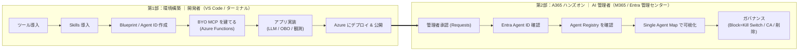

# Agent 365 ハンズオン 

**「AI エージェント」を自分で作り、それを Agent 365 などの管理画面から安全に管理できるようにするまで**を体験する、初学者向けの教材です。

この教材でやることは、大きく次の 4 点です。

1. 🤖 **自分の AI エージェントを用意する** — AI エージェントを、クラウドにデプロイします。
2. 🧩 **エージェントに「道具（ツール）」を持たせる** — エージェントが「**どこと通信し・何を実行するか**」の実体になる**自作の小さな道具（MCP）**を作ります。ここが後の“統制の対象”になります。
3. 🏢 **会社のシステムに登録する** — エージェントを **Microsoft Agent 365** に登録し、**管理画面（Microsoft 365 / Entra 管理センター）** で可視化します（**関係図＝Single Agent Map** でエージェント・道具・利用者が見えます）。
4. 🛡️ **管理者として統制する** — 管理者がエージェントを**ワンクリックで止める（Kill Switch）**など、ガバナンス（統制）が効くことを確認します。

>
> ℹ️ 本教材は「**AI Teammate ではない**タイプ」（人のように Teams に常駐せず、道具として呼び出す形）の AI エージェントを作成します


> ⚠️ **教育目的の教材である。** 自前ホスト LLM・BYO MCP（クラウド公開）を含むため、本番環境では使用しないこと。使い終わったら後片づけ（`a365 cleanup` / リソース削除）を行うこと。
> ⚠️ **Microsoft Agent 365 は Preview を多く含む。** UI・コマンド・仕様・提供条件は変わり得る。正式な情報については Microsoft Learn で最新情報を確認すること。

---

## 全体像（2 部構成）

本教材は「**第1部：環境構築**（作る）」→「**第2部：A365 ハンズオン**（管理センター/Entra で確認・統制する）」の 2 部で進みます。



> 上の図は GitHub 上で自動的に図（ダイアグラム）として表示されます。

| 部 | ゴール | 主な担当・画面 |
|----|--------|---------------|
| 第1部 環境構築 | エージェントが Agent 365 に登録され、Azure（クラウド）で動く | 開発者：VS Code・ターミナル・Azure |
| 第2部 A365 ハンズオン | 登録内容・アクティビティ・ガバナンスを実機で確認できる | AI 管理者：M365 管理センター・Entra 管理センター |

---

## 前提条件

| 項目 | 内容 | ライセンス / 要件 |
|------|------|------------------|
| Microsoft Agent 365 テナント | エージェント登録・観測・ガバナンスの基盤 | **Microsoft Agent 365** または **Microsoft 365 E7**（前提として E5、または Business Premium + Defender/Purview） |
| Azure サブスクリプション | App Service（+ ACR）で自前ホスト。outbound HTTPS 必須 | 従量課金 |
| 開発ツール | Node.js 18+ / Python 3.11+ / a365 CLI / Azure CLI / Azure Functions Core Tools | 無料 |
| Agent 365 Skills | Copilot / Claude Code 用の自動化スキル集 | 無料（`microsoft/agent365-skills`） |
| Frontier Preview（任意） | AI Teammate 機能に必要。**本教材は非 AI Teammate のため必須としない** | — |

> `a365 setup all` は要件チェックで「Frontier Preview Program — テナント登録は自動確認できません」と **Warn** を出すことがある。非 AI Teammate では致命的ではないが、Agent 365 一般前提として求められる場合はここで判断する。

### 操作に必要な権限とロール

作業ごとに必要なロールと、そのロールが属するレイヤ（管理基盤）は以下のとおり。**開発者の作業**と**AI 管理者の作業**が分かれる点に注意する。

| 作業 | 区分 | 必要なロール | 補足 |
|------|------|------------|------|
| Blueprint / Agent ID 作成（`a365 setup all`） | 必須 | Entra: **Application Administrator**（推奨・最小）/ Cloud Application Administrator / Global Administrator | テナント初回のみ `a365 setup requirements` を管理者が実行すれば以降の開発者は引き継ぐ |
| BYO MCP 登録の承認（Tools › Requests） | 必須 | **AI Administrator** または **Global Administrator** | 同意は組織全体に付与される |
| エージェント登録の承認（Agents › Requests） | 必須 | **AI Administrator** または **Global Administrator** | Requests タブで Publish |
| Agent Registry / Agent Map の閲覧 | 必須 | **Global Administrator** または **AI Administrator** ＋ **E7（Agent 365）** | Usage/観測フィルタはテナント < 4,000 ユーザーで有効 |
| Block（Kill Switch）/ 削除 | 必須 | **AI Administrator** | 構成保持の一時停止（Block）と完全削除（Delete）は別物 |
| 条件付きアクセス（全 Agent ID 対象） | 任意 | Entra: **Conditional Access Administrator** / Security Administrator | 本番適用前にレポート専用で影響確認 |
| Azure へのデプロイ | 任意 | Azure RBAC: **Contributor**（作成）/ **User Access Administrator**（RBAC 付与） | App Service + ACR を使う場合 |

> ロール名・付与手順は変更され得る。最新は公式ドキュメントを参照すること。

### 構成ファイル（自前ホスト側）

```text
<PROJECT_DIR>/                       # 例: myagent
├── app.py                           # AgentApplication 本体（on_message で LLM 呼び出し）
├── llm.py                           # OSS LLM（Ollama sidecar, OpenAI 互換）クライアント
├── obo.py                           # OBO トークン交換（jwt-bearer）
├── observability_setup.py           # A365 Observability 配線（use_s2s_endpoint=False）
├── start_server.py                  # aiohttp ホスティング層（Skills 生成）
├── function_app.py                  # BYO MCP サーバー（echo / now） ※別プロジェクトでも可
├── .env                             # a365 setup all がスタンプ（← .gitignore）
├── a365.config.json                 # aiTeammate:false 等の手動 config
├── a365.generated.config.json       # setup 生成（blueprint ID / 同意状況）← .gitignore
└── appPackage/manifest.json         # 公開用 manifest
```

### 用語ミニ辞典

| 用語 | 意味 |
|------|------|
| **Blueprint** | エージェントの「テンプレート」。ここから Agent ID を発行する。これ自体は実体ではない |
| **Entra Agent ID** | エージェントに付与される Entra 上の ID。**instance 化して初めて実値になる** |
| **OBO（委任）** | サインイン中ユーザーの権限で動く。監査は**ユーザー ID**、claim=`scp`、ユーザー同意 |
| **S2S（アプリ専用）** | エージェント自身の権限で動く。監査は**エージェント ID**、claim=`roles`、管理者同意 |
| **BYO MCP** | 自作の外部 MCP サーバーを Agent 365 に登録して使う仕組み |
| **Kill Switch** | 管理センターの Block。構成を保持したまま即時停止（Unblock で復帰） |

---
---

# 第1部：環境構築

> このパートは **開発者**（VS Code / ターミナル）の作業。完了すると、エージェントが Agent 365 に登録され、**Azure（クラウド）**で動く状態になる。

## 1. ツールを導入する

```powershell
node --version      # 18+
az version
a365 --version      # 無ければ: dotnet tool install -g Microsoft.Agents.A365.DevTools.Cli
func --version      # Azure Functions Core Tools（BYO MCP をクラウドにデプロイするのに使う）
```

- [ ] 4 ツールすべてがバージョンを返す
- [ ] `az login --tenant <TENANT_DOMAIN>` 済み

## 2. Agent 365 Skills を導入する

Copilot / Claude Code に自然言語で指示すると、ホスティング層・観測配線・MCP 追加を自動生成してくれる。

```powershell
# GitHub Copilot CLI（gh skill 対応版）
gh skill add microsoft/agent365-skills

# gh skill 非対応版 / VS Code agent mode の場合
git clone https://github.com/microsoft/agent365-skills.git
node <clone>/scripts/install.js   # VS Code の chat.agentSkillsLocations に登録される
```

> 導入後、VS Code は **Reload Window** で反映。7 スキル（`a365-setup` / `make-a365-agent` / `instrument-observability` / `add-workiq-tools` / `test-local` / `make-ai-teammate` / `a365-code-validator`）が使える。

## 3. Blueprint と Agent ID を作る（非 AI Teammate / OBO）

Copilot / Claude Code に次のトリガーフレーズを投げる。

```text
a365-setup を実行して。UPN を持たない Agent を OBO（委任）認可で作りたい。
Make this a non-AI-Teammate Agent using OBO (delegated / on-behalf-of).
```

内部で `a365 setup all`（**`--aiteammate` は付けない**）が実行され、以下が冪等に走る。

```text
要件チェック ─▶ Blueprint 作成 ─▶ 資格情報 ─▶ 委任権限の継承 ─▶ Agent Identity(UPN無し) ─▶ 登録 ─▶ .env スタンプ
```

途中で **2 回の承認**がある（04-register.md と同じ）：
1. **アプリ権限（S2S）の付与** … `Assign this application permission now? [y/N]: y`
2. **委任権限の管理者同意** … ブラウザでサインイン → ダイアログで **Allow**

確認：

```powershell
a365 query-entra                                   # Entra 登録状態
Get-Content a365.generated.config.json | ConvertFrom-Json
```

| 確認項目 | 期待値 |
|---------|--------|
| `a365.config.json` の `aiTeammate` | `false` |
| `completed` | `True`（setup 完走の証拠） |
| `agentBlueprintId` | `.env` の clientId/agentId と整合 |
| `messagingEndpoint` | 後で App Service の URL を指す |
| `resourceConsents` | Graph / Tools / Messaging / Observability が `consentGranted=True` |

> ⚠️ `.env` と `a365.generated.config.json` は**必ず `.gitignore`**。シークレット（保護済みでも）を含む。

## 4. BYO MCP サーバーを建てる（＝通信先・実行内容。ガバナンスの中心）

> **なぜアプリ実装より先か**：Agent 365 の管理では「エージェントが**どこと通信し・何を実行するか**」の把握が必須で、その実体が **MCP（ツール）**。先に MCP を用意しておくと、次のアプリ実装や第2部の観測・ガバナンス（Registry の Data & tools / Single Agent Map / 承認）が「何を監視・制御しているか」を具体物で追える。

学習用に、Azure Functions（クラウド）に MCP サーバーをデプロイして登録する。コードは [付録 A.4](#a4-byo-mcp-サーバーfunction_apppy)。

```powershell
# Azure Functions（クラウド）へデプロイ
func azure functionapp publish <FUNCTION_APP_NAME>
# → 公開 URL: https://<FUNCTION_APP_NAME>.azurewebsites.net/runtime/webhooks/mcp

a365 develop-mcp register-external-mcp-server `
  --server-name "<MCP_NAME>" `
  --server-url  "https://<FUNCTION_APP_NAME>.azurewebsites.net/runtime/webhooks/mcp" `
  --auth-type   "NoAuth" `
  --tools       "echo,now"
# → Entra アプリ2つ自動作成: <MCP_NAME>-A365Proxy / <MCP_NAME>-PublicClients
```

> 承認はこのあと**第2部 §8**（管理者作業）で行う。承認前は利用不可。

## 5. アプリを実装する（LLM / OBO / 観測）

§4 で用意した MCP ツールを、エージェントが呼び出せるように配線する。Skills が生成した骨格に、①LLM 呼び出し ②OBO トークン交換 ③観測配線 を差し込む。**コードの実体は [付録 A. 実装リファレンス](#付録-a-実装リファレンスコード例)** にまとめた。要点のみ：

- **LLM** は遅延初期化（起動時にブロックすると warmup プローブ失敗 → 再起動ループ）
- **OBO** は `use_s2s_endpoint=False`。受け取ったユーザートークンを `jwt-bearer` で観測スコープへ交換
- **観測** は `InvokeAgentScope`（呼び出し全体）と `ExecuteToolScope`（ツール）を計装 → 後段の Single Agent Map の描画元になる

- [ ] `.env`：`ENABLE_A365_OBSERVABILITY=true` / `ENABLE_A365_OBSERVABILITY_EXPORTER=true`
- [ ] `A365_EXPORTER_LOG_LEVEL=DEBUG` で **scp 付きトークン**の 200 送信を確認

## 6. Azure にデプロイして公開する

```powershell
az group create -n <RESOURCE_GROUP> -l <REGION>
# App Service(Linux container)+ACR にデプロイ（Ollama を sidecar）
a365 setup all                  # 実 URL を messaging endpoint に再スタンプ（冪等）
a365 publish                    # manifest.zip 生成
```

`a365 publish` で登録すると、エージェントは **管理センター › Agents › All agents › Requests** に `Pending review` として現れる。**ここから先が第2部**（管理者による承認）。

---
---

# 第2部：A365 ハンズオン（管理センター / Entra で確認・統制する）

> このパートは **AI 管理者**の作業。[Microsoft 365 管理センター](https://admin.microsoft.com/)（Copilot Control System）と [Microsoft Entra 管理センター](https://entra.microsoft.com/) で、第1部で作った内容を確認し、ガバナンスを効かせる。
> 参考: [a365handson Step 4（登録・Entra Agent ID・Block）](https://github.com/ninjyanaka/a365handson/blob/main/04-register.md)

## 8. 管理者が承認する（Requests → Publish）

エージェントは承認されて初めて利用可能になる。

1. [Microsoft 365 管理センター](https://admin.microsoft.com/) にサインイン
2. **Agents › All agents › Requests** を開く（`Pending review` / `Pending activate` を確認）
3. 対象エージェントを開く（この時点では **Entra agent ID は「—」**）→ **Publish to store**（承認）
4. 「**Publish new agent**」ウィザードを進める：
   1. **Select users** — インストール可能なユーザー（All users / 特定）を選択
   2. **Apply template** — ポリシーテンプレート。条件付きアクセス（例「Block - High Risky Agent」）等を適用（→ §12）
   3. **Review permissions** — エージェントが要求する権限を確認し、必要なら管理者同意
   4. **Review and finish → Publish**

<!--  -->

> **BYO MCP の承認も同様**：**Agents › Tools › Requests (preview)** で `<MCP_NAME>` を開き **Approve** →（`-A365Proxy` / `-BYO` / ランタイムの）管理者同意 → Status が **Available**（承認まで利用不可）。

✅ 承認が完了するとエージェントは `Pending review` から外れ、利用可能になる。

## 9. Entra Agent ID を確認する

承認済みの blueprint を「使える実体」にすると、**Entra Agent ID が「—」から実値の GUID に変わる**。

1. 管理センター › **Agents** で対象 blueprint を開く → **`+ Add instance`**（または対象の登録を有効化）
2. 作成後、blueprint / instance の **Overview の Entra agent ID** が実値化することを確認
3. [Entra 管理センター](https://entra.microsoft.com/) › **Agent identities**（Enterprise apps）で同じ Agent ID が見えることを確認

<!--  -->

> **本教材は非 AI Teammate** のため、**agent user（UPN）や Teams の `@mention` は作られない**（それは AI Teammate 専用）。本エージェントの呼び出しは Copilot Studio カスタムエンジン / REST（App Service の `/chat`）/ OBO クライアント経由で行う。
> この Entra agent ID の値が、そのまま Observability の `agentId` になる（Single Agent Map の突き合わせキー）。

## 10. Agent Registry をタブ別に確認する

管理センター › **Agents › All agents › Registry** で対象を開き、各タブで「登録内容」を確認する。

| タブ | 見るもの |
|------|---------|
| **Details** | Publisher type / Owner / Entra agent ID / Channel |
| **Users** | 利用ユーザー |
| **Data & tools** | Capabilities / Knowledge / **Tools（BYO MCP の echo・now がここに出る）** |
| **Security** | Microsoft Purview（活動監視・機密データ保護）＋ Microsoft Entra（ID 保護・Agent ID）。右上に **Block** |
| **Permissions** | 付与権限（Granted / Delegated） |
| **Activity** | Active users / Sessions / Exceptions と時系列グラフ |

<!--  -->

## 11. Single Agent Map で可視化する（Preview）

観測データが、エージェント ↔ ユーザー ↔ ツールの関係図として描かれる。**Map を点灯させるには、クラウド上のエージェントを実際に呼び出して活動を作る**必要がある。

### 11.0 Map 点灯用のアクティビティを作る（クラウドのエージェントを呼ぶ）

承認済み（§8）のエージェントを、クラウド経由で実際に使って観測データを溜める：

- [ ] `echo` / `now` を**複数回**呼ぶ → Map の **Tool ノード**が出る（呼ぶほど線が太い）
- [ ] **複数ユーザー**で叩く（OBO なので別ユーザーでサインイン）→ **User ノード**が増える
- [ ] （デモ映え）ツールを**一定確率で失敗**させ exception rate を **>1%** に → Map で**赤いハイライト線**
- [ ] 呼び出し方法：Copilot Studio カスタムエンジン / REST（App Service の `/chat`）/ OBO クライアント

**要件**：E7（Agent 365）＋ Global Administrator か AI Administrator。Usage/観測はテナント **< 4,000 ユーザー**で有効。

1. 管理センター › **Agents › All Agents › Map**
2. **観測データを持つ**自分のエージェントを選択 → サマリ（users / sessions / exceptions）を確認
3. **All connections** を選択 → **Single Agent Map** が開く

| ノード | 内容 |
|--------|------|
| Agent | 詳細・サマリ活動 |
| User（top 50） | クリックでユーザー詳細 |
| Tool（top 50） | tool calls・exception 数・last activity（**echo / now** が出る） |

- **線の太さ** = interaction volume、**exception >1% の線は赤**
- 空表示なら §5（観測配線）と §11.0（アクティビティ生成）を見直す

<!--  -->

> Single Agent Map は「1 エージェント ↔ ユーザー ↔ ツール」に限定で、**agent-to-agent の線は描かれない**。マルチエージェント化は**テナント全体の Agent Map（クラスタ表示）**を豊かにする用途。

## 12. ガバナンス — Block（Kill Switch）/ 条件付きアクセス / 削除

エージェントを止めるには「**無効化（Block）**」→「**削除（Delete）**」の 2 レベルがある。まず無効化、確証が取れてから削除、が安全な順序。

### 12.1 Block（Kill Switch）— 構成保持のまま即時停止

| 粒度 | 対象 | 効果 |
|------|------|------|
| **Blueprint 単位** | エージェント全体 | 組織全体で利用不可。全ユーザー・全 instance に波及 |
| **Instance 単位** | 個々の instance | その instance だけ停止。他は影響なし |

1. 管理センター › **Agents › All agents** で対象を開く（`Available`）→ 右上 **Block**
2. **Block agent** にチェック、任意で Reason を記入 → **Save**
3. ステータスが **Blocked** に。「removed from all users in your organization」。ボタンは **Unblock** に変化
4. 解除は **Unblock** → チェック → Save で `Available` に復帰

<!--  -->

### 12.2 条件付きアクセス（テナント全体）

さらに広く止めるなら Entra の条件付きアクセスで「**すべてのエージェント ID**」を対象にトークン発行をブロックできる（既存・新規の Agent ID をまとめて認証不可）。**本番適用前にレポート専用モードで影響を確認**する。

- 出典: [エージェント向け条件付きアクセス](https://learn.microsoft.com/entra/identity/conditional-access/agent-id)

### 12.3 削除（リタイア）と後片付け

| | Block（無効化） | Permanent delete（削除） |
|--|----------------|--------------------------|
| 何が起きる | 認証・トークン発行を止める。オブジェクトは残る | オブジェクトを消す（子も連鎖削除） |
| 構成・データ | 保持（Unblock で復帰） | 失われる（30 日は論理削除で復元可） |
| クォータ | 消費したまま | 完全削除まで消費（250 上限に注意） |

- 個別: instance 詳細 › **Permanent delete**
- 一括（自前ホスト）: 作業ディレクトリで `a365 cleanup`（**破壊的**。config の blueprint 配下を一括削除）
- orphan アプリ確認: `az ad app list --display-name "<blueprint名>" -o table` → `az ad app delete --id <appId>`

> ⚠️ **後片づけ必須**：学習が終わったら Block ではなく `a365 cleanup` で消し、Azure リソース（App Service / Functions）も削除する。連鎖クリーンアップは非同期で数時間〜数日かかることがある。

✅ **完了条件**：管理センターで Block → 実際に停止、Unblock → 復帰、を確認できる。Single Agent Map に自分の agent・Tool（echo/now）・User が描画される。

---
---

# 付録

## 付録 A. 実装リファレンス（コード例）

> Preview 前提の実装スケルトン。着手時に現行 SDK / Learn で最終確認すること。

### A.1 LLM クライアント（`llm.py`）

```python
# llm.py — Ollama sidecar (OpenAI 互換) への接続。起動時ブロック回避のため lazy。
from openai import OpenAI, APIConnectionError
from os import environ
import time

_client: OpenAI | None = None

def get_llm() -> OpenAI:
    global _client
    if _client:
        return _client
    c = OpenAI(base_url=environ.get("OLLAMA_BASE_URL", "http://localhost:11434/v1"),
               api_key="ollama")
    for _ in range(60):                     # warmup を待つ（最大 60s）
        try:
            c.models.list(); _client = c; return c
        except APIConnectionError:
            time.sleep(1)
    raise RuntimeError("Ollama sidecar not ready")

SYSTEM_PROMPT = environ.get("SYSTEM_PROMPT",
    "あなたは日本語で簡潔に答えるアシスタントです。")

def chat_complete(user_text: str) -> str:
    r = get_llm().chat.completions.create(
        model=environ.get("OLLAMA_MODEL", "qwen2.5:3b-instruct-q4_K_M"),
        messages=[{"role": "system", "content": SYSTEM_PROMPT},
                  {"role": "user", "content": user_text}])
    return r.choices[0].message.content or ""
```

### A.2 メッセージ処理（`app.py`）

```python
# app.py（抜粋）— Skills 生成の AgentApplication に LLM を差し込む
from microsoft_agents.hosting.core import AgentApplication, MemoryStorage, TurnContext, TurnState
from start_server import build_adapter
from llm import chat_complete

AGENT_APP = AgentApplication[TurnState](storage=MemoryStorage(), adapter=build_adapter())

@AGENT_APP.message("/help")
async def _help(ctx: TurnContext, _: TurnState):
    await ctx.send_activity("Send any message to chat.")

@AGENT_APP.activity("message")
async def _on_message(ctx: TurnContext, _: TurnState):
    reply = chat_complete(ctx.activity.text or "")
    await ctx.send_activity(reply)
```

### A.3 OBO トークン交換 ＋ 観測配線（`obo.py` / `observability_setup.py`）

```python
# obo.py — 受け取ったユーザートークンを観測用スコープの OBO トークンに交換
import msal
from os import environ

_cca = msal.ConfidentialClientApplication(
    client_id=environ["CONNECTIONS__SERVICE_CONNECTION__SETTINGS__CLIENTID"],
    authority=f"https://login.microsoftonline.com/{environ['TENANT_ID']}",
    client_credential=environ.get("CLIENT_SECRET"),  # 本番は Managed Identity / FIC 推奨
)
OBS_SCOPE = ["api://<obs-app-id>/Agent365.Observability.OtelWrite"]

def exchange_obo(user_assertion: str) -> str | None:
    r = _cca.acquire_token_on_behalf_of(user_assertion=user_assertion, scopes=OBS_SCOPE)
    return r.get("access_token")
```

```python
# observability_setup.py（抜粋）— exporter を OBO エンドポイントへ
from microsoft_agents_a365.observability.core import configure
from microsoft_agents_a365.observability.core.exporters.agent365_exporter_options import (
    Agent365ExporterOptions)
from obo import exchange_obo

_current_user_token: dict[str, str] = {}   # request context から供給

def _token_resolver(agent_id: str, tenant_id: str) -> str | None:
    ua = _current_user_token.get("assertion")
    return exchange_obo(ua) if ua else None

configure(
    service_name="<AGENT_NAME>-runtime",
    service_namespace="ai.agents.selfhosted",
    exporter_options=Agent365ExporterOptions(
        token_resolver=_token_resolver,
        use_s2s_endpoint=False,     # ★OBO: /observability/… (agentic token cache)
    ),
)
```

### A.4 BYO MCP サーバー（`function_app.py`）

```python
# function_app.py — 学習用ダミーツール2個（echo / now）
# ※ Azure Functions の MCP tool trigger（Preview）。バインド仕様は現行 SDK で要確認。
import azure.functions as func
import datetime, json

app = func.FunctionApp()

_ECHO_PROPS = json.dumps([
    {"propertyName": "text", "propertyType": "string", "description": "echo する文字列"}
])

@app.generic_trigger(arg_name="context", type="mcpToolTrigger",
                     toolName="echo", description="入力をそのまま返す",
                     toolProperties=_ECHO_PROPS)
def echo(context) -> str:
    args = json.loads(context).get("arguments", {})
    return args.get("text", "")

@app.generic_trigger(arg_name="context", type="mcpToolTrigger",
                     toolName="now", description="現在の UTC 時刻を返す",
                     toolProperties="[]")
def now(context) -> str:
    return datetime.datetime.utcnow().isoformat() + "Z"
```

## 付録 B. よく使う a365 コマンド

| コマンド | 用途 |
|---|---|
| `a365 setup all` | 前提〜ID 発行〜`.env` スタンプ（冪等） |
| `a365 develop get-token` | 開発/テスト用トークン取得 |
| `a365 develop-mcp register-external-mcp-server` | 外部 MCP 登録 |
| `a365 query-entra` | Entra 登録状態の照会 |
| `a365 publish` | manifest.zip 生成（→ Requests に Pending review） |
| `a365 logs export` | 実行ログのエクスポート |
| `a365 cleanup` | 全 Agent 365 リソース削除（**破壊的**） |

## 付録 C. トラブルシュート早見

| 症状 | 確認 |
|---|---|
| 起動直後に再起動ループ | LLM を遅延初期化したか（warmup 前に `list()` を呼ぶな） |
| 観測が 401 リトライ | OBO 交換の scp・`use_s2s_endpoint=False` |
| Teams に届かない（AI Teammate 時） | `messagingEndpoint` が古い/別物（最頻出の罠） |
| MCP が使えない | Tools › Requests で承認（Available）待ちか |
| Single Agent Map が空 | ①観測未配線 ②アクティビティ不足 ③ライセンス/ロール ④テナント≥4,000人 |
| `blueprint principal does not exist` | `a365 setup all` を通す（principal 未作成） |

## 付録 D. セキュリティ必須チェック

- [ ] `.env` / `a365.generated.config.json` を `.gitignore`
- [ ] シークレットは本番で **Managed Identity / Workload Identity（FIC）** に移行
- [ ] BYO MCP の Functions は `NoAuth`（学習用）。本番は認証を付与する
- [ ] 最小権限（付与前に権限内容を必ず確認）
- [ ] 学習後は `a365 cleanup` で後片付け

## 参考リンク

- [Agent 365 Developer Docs](https://learn.microsoft.com/microsoft-agent-365/developer/)
- [On-Behalf-Of フロー（Microsoft Entra Agent ID）](https://learn.microsoft.com/entra/agent-id/agent-on-behalf-of-oauth-flow)
- [Manage agent registry（管理センター）](https://learn.microsoft.com/microsoft-365/admin/manage/agent-registry)
- [Manage agent requests（承認）](https://learn.microsoft.com/microsoft-365/admin/manage/agent-requests)
- [Use Agent Map / Single Agent Map](https://learn.microsoft.com/microsoft-365/admin/manage/agent-map)
- [Manage tools for agents（Tools・BYO MCP）](https://learn.microsoft.com/microsoft-365/admin/manage/manage-tools-for-agent)
- [エージェント向け条件付きアクセス](https://learn.microsoft.com/entra/identity/conditional-access/agent-id)
- [Agent management roles & permissions](https://learn.microsoft.com/microsoft-365/admin/manage/agent-roles-perms)
- [microsoft/agent365-skills](https://github.com/microsoft/agent365-skills)
- 元ハンズオン: [ninjyanaka/a365handson](https://github.com/ninjyanaka/a365handson)（特に [Step 4 登録](https://github.com/ninjyanaka/a365handson/blob/main/04-register.md)）

> ※ Microsoft Agent 365 は Preview を多く含む。UI・コマンド・仕様は変わり得る。着手前に一次情報で最新確認すること。
