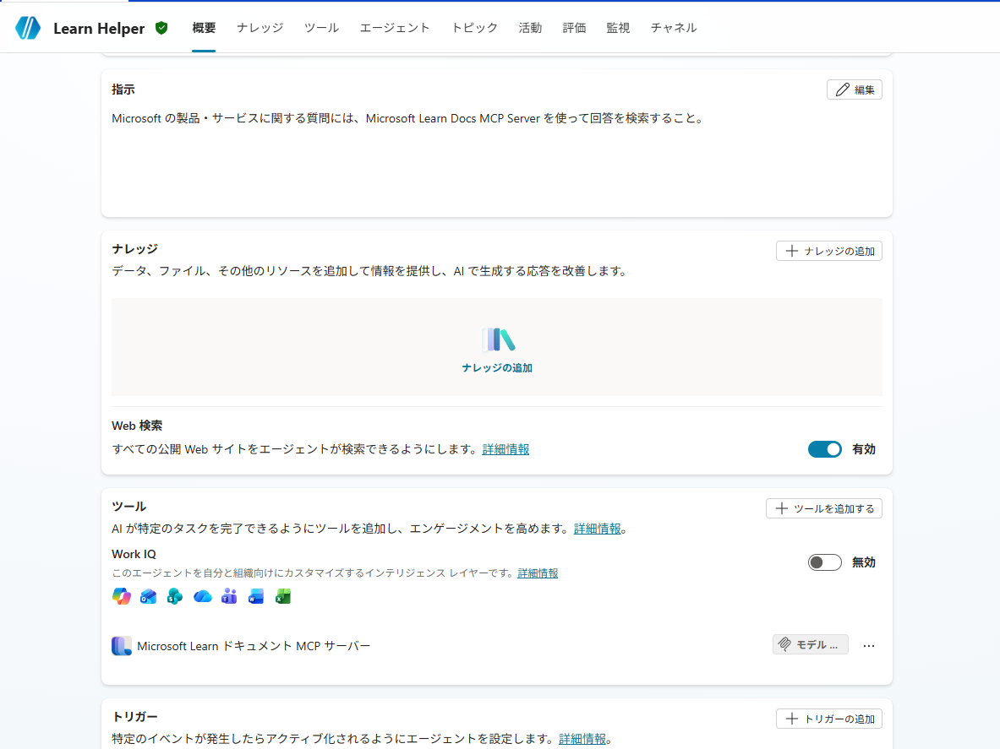

# 第1部 A：Copilot Studio で AI エージェントを作る（開発者）

ノーコード／ローコードの **Microsoft Copilot Studio** でエージェントを作り、Teams / Microsoft 365 Copilot チャネルに公開して、組織のカタログに**申請**するまで。今回は具体例として、**無償の Microsoft Learn Docs MCP Server** を道具に使う「**Learn ヘルパー**」（Microsoft / Azure の質問に Learn の公式情報で答えるエージェント）を作る。MCP を呼ぶので、第2部の Observability（観測）に「ツール呼び出し」の記録が残る。


> ⚠️ Microsoft Agent 365 / Copilot Studio は Preview を多く含む。コマンド・API は変わり得るので、Microsoft Learn で最新情報を確認すること。

**目次**

- [第1部 A：Copilot Studio で AI エージェントを作る（開発者）](#第1部-acopilot-studio-で-ai-エージェントを作る開発者)
  - [1. エージェントを作る](#1-エージェントを作る)
  - [2. 無償の Microsoft MCP を道具として足す](#2-無償の-microsoft-mcp-を道具として足す)
  - [3. 公開して組織に申請する](#3-公開して組織に申請する)


|  |
|:-:|

## 1. エージェントを作る

今回作るのは「**Learn ヘルパー**」エージェント — Microsoft / Azure の質問に、無償の **Microsoft Learn Docs MCP Server**（Microsoft 提供の認定コネクター）を使って Learn の公式情報から答えるエージェント。

1. [Copilot Studio](https://copilotstudio.microsoft.com/) にサインイン（画面上部の **Environment**（環境）セレクターで対象環境を確認）
2. 左ペインの **Agents** → 上部の **+ Create blank agent（空のエージェントを作成）**
3. 名前の入力を求められたら **`Learn Helper`** と入力して **Create**
4. プロビジョニング（数十秒）の後、エージェントの **Overview（概要）** ページが開く
5. **詳細（Details）** セクションの **Edit（編集）** を開き、説明に下記を入力して保存
   ```text
   Microsoft / Azure の質問に Microsoft Learn の公式情報で答えるアシスタント。
   ```
6. **Model（モデル）** セクションで言語モデルを選ぶ（テスト用途なので GPT-4.1）

## 2. 無償の Microsoft MCP を道具として足す

Microsoft 提供の **Microsoft Learn Docs MCP Server**（無償・認定コネクター）を道具として追加する。これで「Learn を検索する」という道具呼び出しが発生し、第2部の Observability に残る。

1. 上部タブ **ツール** → **+ ツールを追加する**
2. フィルタリング対象を ”モデルコンテキストプロトコル” にしたうえで、 検索欄に `Microsoft Learn Docs MCP` と入力して検索
3. **Microsoft Learn Docs MCP Server** を選ぶ
4. 接続（Connection）の作成を求められた場合、**新しい接続を追加**（Create new connection）を選び、接続を作成する
5. **追加と構成** を押下してエージェントに追加する
6. 上部タブ **概要** に戻り、**指示** に MCP の利用タイミングを指定したうえで保存
   ```text
   Microsoft の製品・サービスに関する質問には、Microsoft Learn Docs MCP Server を使って回答を検索すること。
   ```
7. **テスト** ペインで「Microsoft Entra の条件付きアクセスとは？」などと質問。Learn を検索して答えれば成功

> **テストで「まずは接続して … この資格情報を『接続マネージャーを開く』で検証してください」と出たら**：メッセージ内の **接続マネージャーを開く**（またはツール詳細）から対象の接続を作成／認可し、「接続済み」になってから **再試行** する。


## 3. 公開して組織に申請する

作っただけでは他のユーザーは使えない。**公開（Publish）してチャネルに接続し、組織カタログへ申請**する。

1. 右上の **公開** でエージェントを ”最新バージョンを強制する” オプションを設定したうえで公開する
2. 上部タブ **チャネル** → **Microsoft 365 と Microsoft Teams** を開く
3. **Microsoft 365 をオンにする** のチェックを有効にして、**チャネルを追加**する
4. 同じ設定パネルで **可用性オプション** を開く
5. **組織内の全員に表示する** を選ぶ
6. 要件を確認して **組織カタログに送信**する → 確認で **はい**（この操作で管理者承認へ回る）

---

→ 次：**[第2部 A：承認と観測データ作成](./part2-1a-copilotstudio.md)** ｜ [README（概要）](../README.MD)
