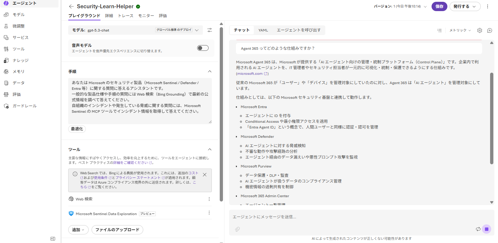

# 第1部 B：Azure AI Foundry で AI エージェントを作る（開発者）

**ノーコード**で **Microsoft Foundry ポータル**（[ai.azure.com](https://ai.azure.com/)）の「**エージェントの構築**」（コードを書かずに指示・ツール・ナレッジを構成するタイプ。Learn 上では **Prompt agent** と呼ばれる）を使い、**Microsoft Sentinel MCP** と **Bing Grounding（Web 検索）** を道具として追加し、**Agent 365 に公開申請**するまで。今回は具体例として、Microsoft のセキュリティ製品に関する質問に、Web 検索と Sentinel のインシデント情報の両方から答える「**セキュリティ Learn ヘルパー**」を作る。

> ⚠️ Microsoft Agent 365 / Foundry は Preview を多く含む。コマンド・API は変わり得るので、Microsoft Learn で最新情報を確認すること。

**目次**

- [第1部 B：Azure AI Foundry で AI エージェントを作る（開発者）](#第1部-bazure-ai-foundry-で-ai-エージェントを作る開発者)
  - [1. 前提の確認](#1-前提の確認)
  - [2. Foundry プロジェクトを準備する](#2-foundry-プロジェクトを準備する)
  - [3. Agent Builder で Prompt agent を作る](#3-agent-builder-で-prompt-agent-を作る)
  - [4. ツールを追加する（Bing Grounding / Microsoft Sentinel MCP）](#4-ツールを追加するbing-grounding--microsoft-sentinel-mcp)
    - [4-1. Bing Grounding（Web 検索）](#4-1-bing-groundingweb-検索)
    - [4-2. Microsoft Sentinel MCP（インシデント参照）](#4-2-microsoft-sentinel-mcpインシデント参照)
  - [5. Agent 365 へ Autopilot として公開する](#5-agent-365-へ-autopilot-として公開する)

## 1. 前提の確認

Prompt agent は Foundry ポータルだけで作れるが、**Agent 365 への Autopilot 公開**には次の前提がテナント側に必要（詳細は [README の前提条件](../README.MD#前提条件)を参照）：

- テナントが **Frontier Preview Program** に登録済みであること（公式 Learn に「Foundry→Agent 365 のデータ連携の前提条件」と明記）
- 最低 1 名が **Microsoft 365 Copilot** など Agent 365 の対象ライセンスを保有していること
- Global Administrator が [Microsoft 365 管理センター](https://admin.microsoft.com/) で Agent 365 を有効化し、利用規約に同意済みであること
- 自分自身は Foundry プロジェクトスコープの **Foundry User** または **Foundry Project Manager** ロールを持っていること

## 2. Foundry プロジェクトを準備する

エージェントを作るには、モデルをデプロイ済みの **Microsoft Foundry プロジェクト**が要る。既存のプロジェクトがあればそれを使ってよい。

1. [Foundry ポータル](https://ai.azure.com/) にサインイン
2. プロジェクトが無ければ新規作成（モデル：テスト用途なので `gpt-4.1` や `gpt-5-mini` など軽量なものでよい）

## 3. ノーコードでエージェントを作る

|  |
|:-:|

1. プロジェクトを開くとホーム画面が表示される。右側の **エージェントの構築**（「コードを記述せずに、指示、ツール、ナレッジを構成して AI エージェントを作成します。」）カードの **構築の開始** を選ぶ
   - 隣の **エージェントのコーディング**（Microsoft Agent Framework でコードを書く Hosted agent 用）は選ばない
2. **エージェントの作成** ダイアログで **エージェント名** を入力する。**英数字で開始・終了し、途中にはハイフンのみ使用可（スペース不可）**。例：`Security-Learn-Helper`
3. **作成** を押すと、そのままエージェントの編集画面（プレイグラウンド）が開く
4. 画面上部の **モデル** ドロップダウンで使うモデルを確認・選択する（新規作成時は既定でデプロイ済みモデルが選ばれている。テスト用途ならそのままでよい）
5. **手順** 欄に、下記のようなプロンプトを入力する

   ```text
   あなたは Microsoft のセキュリティ製品（Microsoft Sentinel / Defender / Entra 等）に関する質問に答えるアシスタントです。
   一般的な製品仕様や手順の質問には Web 検索（Bing Grounding）で最新の公式情報を調べて答えてください。
   自組織のインシデントや発生している脅威に関する質問には、Microsoft Sentinel の MCP ツールでインシデント情報を取得して答えてください。
   ```

6. 右上の **保存** を押す

## 4. ツールを追加する（Bing Grounding / Microsoft Sentinel MCP）

エージェント編集画面の **手順** の下に **ツール** セクションがあり、ここでエージェントに使わせる道具を管理する。

### 4-1. Bing Grounding（Web 検索）

新規作成した時点で、**ツール** セクションに既定で **Web検索**（Bing Grounding を使った Web 検索）が追加されている。画面には「追加のコストが発生する」「顧客データは Azure コンプライアンス境界の外に送信される」という注記が出るので内容を確認する。今回はこれをそのまま使う（不要なら項目右の **×** で外せる）。

### 4-2. Microsoft Sentinel MCP（インシデント参照）

> ⚠️ **実機未確認**：ここから先（ツールセクションを下にスクロールした際の「+ ツールを追加」に相当するボタンの位置、Sentinel MCP の検索・接続手順）はスクリーンショットが無いため、想像で書かず一旦保留する。実際の画面（ツール セクションを一番下までスクロールした様子）を見せてほしい。
>
> 前提として確認しておきたい点：対象テナントで Microsoft Sentinel／Defender XDR が有効化されており、自分が対象ワークスペースに **Security Reader** 以上のロールを持っていること。

## 5. Agent 365 へ Autopilot として公開する


1. **プレイグラウンド（Playground）** で一度チャットし、Bing Grounding / Sentinel MCP それぞれを使う質問（例：「Microsoft Sentinel の Analytics ルールとは？」「直近のインシデントを教えて」）で応答を確認する
2. エージェント詳細画面で **公開（Publish）** に類する操作を探し、**Microsoft Teams / Microsoft 365** を選ぶ
3. 公開処理により、Agent 365 側に **Blueprint**（承認待ちのエージェント登録要求）が作成される
4. [第2部 B：承認と観測データ作成（Foundry）](./part2-1b-foundry.md) で AI 管理者が承認する

---

← 戻る：[README（概要）](../README.MD) ｜ 次：**[第2部 B：承認と観測データ作成（Foundry）](./part2-1b-foundry.md)**
