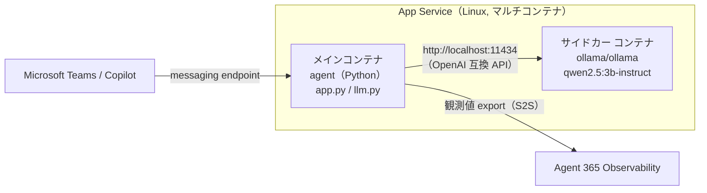

# 第1部 C：独自エージェント（S2S）を作る（開発者）

自前ホストの LLM（Qwen）で動く**独自エージェント**をコードから作って Azure にデプロイし、Agent 365 に登録申請するまで。認証は **S2S（サービスプリンシパル）** を使う。完了すると、エージェントが Agent 365 に登録され、Azure（クラウド）で動く状態になる。

> 💡 ノーコード／ローコードで手早く作りたいなら **[第1部 A：Copilot Studio で作る](./part1a-copilot-studio.md)** や **第1部 B：Microsoft Foundry で作る** もある。本ファイル（C）は「フルコードで自前ホスト」を学ぶ上級ルート。

> ⚠️ Microsoft Agent 365 は Preview を多く含む。コマンド・API は変わり得るので、Microsoft Learn で最新情報を確認すること。

**目次**

- [第1部 C：独自エージェント（S2S）を作る（開発者）](#第1部-c独自エージェントs2sを作る開発者)
  - [構成ファイル（参考）](#構成ファイル参考)
  - [0. 最初に「名前」を決める（1 回だけ）](#0-最初に名前を決める1-回だけ)
  - [1. ツールを用意して Azure にログインする](#1-ツールを用意して-azure-にログインする)
  - [2. Agent 365 Skills を導入する](#2-agent-365-skills-を導入する)
  - [3. エージェントの「土台」を作る（Blueprint / Agent ID）](#3-エージェントの土台を作るblueprint--agent-id)
  - [4. エージェント本体を実装する](#4-エージェント本体を実装する)
  - [5. Azure にデプロイして「登録」する](#5-azure-にデプロイして登録する)
    - [5-1. コンテナレジストリと App Service を作る](#5-1-コンテナレジストリと-app-service-を作る)
    - [5-2. Ollama（LLM）を sidecar で追加](#5-2-ollamallmを-sidecar-で追加)
    - [5-3. エージェントの endpoint を Agent 365 に登録する](#5-3-エージェントの-endpoint-を-agent-365-に登録する)
    - [5-4. Bot App / Bot Service を作り Teams チャネルを有効化する](#5-4-bot-app--bot-service-を作り-teams-チャネルを有効化する)
  - [6. Teams App Package（manifest.json / m365agents.yml）を作る](#6-teams-app-packagemanifestjson--m365agentsymlを作る)

完了後は **[第2部 C：承認と観測データ作成](./part2-1c-custom.md)** で承認・Teams 接続・観測データ作成を行い、その後 Observe / Govern / Secure に進む。

## 構成ファイル（参考）

このルートで扱うファイルは **(1) 自作コード**、**(2) `a365 setup all` が自動生成するもの**、**(3) シークレット** の 3 種に分かれる。(1) は [`../src/`](../src) 下にまとめて置く：`agent/`（エージェント本体）の横に、`appPackage/`（Teams App Package の定義）と `m365agents.yml`（Teams App の provision/publish 定義）を並べて置く（Teams パッケージはエージェント単体のコードとは別層の概念のため、`agent/` の中には入れない）。(2)・(3) は各自の環境で生成されるためリポジトリには含まれない。

```text
Agent365-Training/
└── src/
    ├── agent/                       # (1) エージェント本体（App Service にデプロイ）= a365 setup all のプロジェクトルート
    │   ├── app.py                   #     頭脳：発言を受け取り AI に渡して返答する（per-turn のトークン交換には一切関与しない）
    │   ├── llm.py                   #     AI（自前ホストの Qwen）に質問して答えをもらう（ツール呼び出しなしのシンプルな chat completion）
    │   ├── start_server.py          #     受付と起動：aiohttp サーバーで外部からのメッセージを app.py へ橋渡し。S2S 観測トークンのバックグラウンド取得もここで起動
    │   ├── observability_setup.py   #     観測の初期化の入口（現行 distro use_microsoft_opentelemetry、S2S エンドポイント）
    │   ├── observability/           #     S2S 観測トークン取得（token_service.py）とキャッシュ（token_cache.py）
    │   ├── requirements.txt         #     必要な Python ライブラリ
    │   ├── Dockerfile               #     コンテナ化の定義
    │   ├── a365.config.json         # (2) `a365 setup all` に渡す設定ファイル
    │   ├── .env                     # (3) 秘密情報：接続キー等。`a365 setup all` が自動で書き込む（共有・コミット禁止）
    │   └── a365.generated.config.json # (3) 秘密情報：`a365 setup all` が作る ID・同意状況（共有・コミット禁止）
    │
    ├── ollama-sidecar/              #  (1)  Ollama sidecar 用カスタムイメージ（ACR にビルド）
    │   ├── Dockerfile                #    ollama/ollama をベースに ENTRYPOINT を差し替え
    │   └── entrypoint.sh             #    serve 起動＋モデル自動 pull のラッパー
    │
    ├── appPackage/manifest.json     # (1) Teams App Package の定義
    └── m365agents.yml               # (1) Teams App の provision/publish ライフサイクル定義
```

## 0. 最初に「名前」を決める（1 回だけ）

以降のコマンドはこの変数をそのまま使う。**`xxxx` を自分用のユニークな文字列に変えて**、ターミナルに貼り付ける（PowerShell）。

```powershell
$RG    = "rg-agent365-training"                # リソースグループ（トレーニング一式をまとめる箱）
$LOC   = "japaneast"                           # リージョン
$ACR   = "acragent365trainingxxxx"             # コンテナレジストリ：Qwen エージェントのコンテナ格納（世界で一意・小文字英数のみ）
$PLAN  = "plan-agent365-training"              # App Service プラン（エージェント本体をホストする土台）
$APP   = "app-agent365-training-agent-xxxx"    # エージェント本体（頭脳）の Web アプリ（世界で一意）
$A365NAME = "a365-agent-xxxx"                  # a365 CLI の --agent-name（**20 文字以内**。後で " Blueprint" が付いて Teams manifest の name.short 上限 30 文字に到達するため）
$AGENT = "agent365-training-agent-xxxx"        # エージェント名（Bot/Teams 命名用）
$BOTAPP = "agent365-training-bot"              # Bot 用 Entra App の表示名（表示名のため一意性は不要）
$BOTSVC = "bot-agent365-training"              # Azure Bot Service リソース名（$PLAN と同様、RG 内で一意なら可）
```

## 1. ツールを用意して Azure にログインする

まず教材リポジトリを取得する。

```powershell
# 教材（本リポジトリ）を clone して作業ディレクトリに入る
git clone https://github.com/fatman3110/Agent365-Training.git
cd Agent365-Training
cd src/agent
```

次に必要なツールを確認する（無ければ各コメントのコマンドで導入）。

```powershell
# バージョンが返れば OK（無ければ各コメントのコマンドで導入）
node --version   # 無ければ: winget install OpenJS.NodeJS.LTS
az   version     # 無ければ: winget install Microsoft.AzureCLI
func --version   # 無ければ: npm i -g azure-functions-core-tools@4
a365 --version   # 無ければ: dotnet tool install -g Microsoft.Agents.A365.DevTools.Cli
m365agentstoolkit-cli --version   # 無ければ: npm i -g @microsoft/m365agentstoolkit-cli

# Azure にサインイン
az login
```

## 2. Agent 365 Skills を導入する

これを導入すると、Github Copilot / Claude Code に自然言語で指示したときに、Blueprint 作成（`a365-setup`）や観測の詳細配線（`instrument-observability`）を Skill が代わりに実行してくれる。

```powershell
# ★ src/agent の外（リポジトリルート）で clone する。ここで clone すると .dockerignore で
cd ..\..                                    # src/agent → リポジトリルートへ
git clone https://github.com/microsoft/agent365-skills.git
node .\agent365-skills\scripts\install.js   # VS Code の chat.agentSkillsLocations に登録
cd src\agent                                # 作業ディレクトリを src/agent に戻す
```

## 3. エージェントの「土台」を作る（Blueprint / Agent ID）

> **作業ディレクトリ（重要）**：`a365-setup` / `a365 setup all` は「実行したフォルダ」を**エージェントのプロジェクト**とみなし、そこにリソースを生成する。本教材ではエージェント本体のコードがある **`src/agent`** をプロジェクトとして扱う。

**ターミナルのコマンドではなく、AI チャットに次の指示を送る**と、先ほど導入した Skill が起動し、必要なコマンドを AI が代わりに実行してくれる。**エージェント名の置き換え**を忘れないこと

```text
a365-setup を実行して。作業ディレクトリは src/agent。エージェント名は a365-agent-xxxx。UPN を持たない Agent を S2S（サービスプリンシパル）認可で作りたい。
```

> **この指示の意味**
> - **a365-setup を実行して** … Skill（`a365-setup`）を起動する合図
> - **エージェント名** … `a365 setup all --agent-name` に使われる名前（**20 文字以内**。後で Teams manifest の `name.short` に `" Blueprint"` が付いて使われるため）
> - **UPN を持たない Agent** … 人間のようなメールアドレス／ログイン名（UPN）を**持たない**エージェント = **非 AI Teammate**
> - **S2S（サービスプリンシパル）認可** … ユーザーの代理（OBO）ではなく、エージェント自身のサービスプリンシパル資格情報で動く方式。

Skill は対話形式で進む。指示に従って、承認やブラウザ認証を行う：
1. `[yes/no]:` の選択  → 内容を確認したうえで、AI チャットに `yes` を送付
2. ブラウザが開く → サインインと権限の承認

Skill が内部で `a365 setup all --agent-name a365-agent-xxxx --authmode s2s` を実行し、以下を行う。

```text
要件チェック ─▶ Blueprint 作成 ─▶ 資格情報 ─▶ 権限の継承 ─▶ Agent Identity 作成(UPN無し) ─▶ 登録 ─▶ ローカルの .env へ接続情報を書き込み
```

- **成功の判定**：ローカルに作成された `a365.generated.config.json` の **`agentBlueprintId` に ID が入っていること** 

## 4. エージェント本体を実装する

1. `.env` に ローカル LLM 関連の設定とモニタリング関連の設定を追記。
   ```powershell
   Add-Content ".env" @"
   OLLAMA_BASE_URL=http://localhost:11434/v1
   OLLAMA_MODEL=qwen2.5:3b-instruct-q4_K_M
   ENABLE_A365_OBSERVABILITY=true
   ENABLE_A365_OBSERVABILITY_EXPORTER=true
   "@
   ```
2. 観測の詳細配線は **Skill に任せる**。下の指示を AI チャットに送ると、Skill（`instrument-observability`）が現行ディストロ `use_microsoft_opentelemetry(...)` とスコープ（InvokeAgentScope 等）の配線コードを生成する。戦術の AI チャットへの指示ですでに作成済みの場合もあるが２重命令となっても LLM が判断してくれるので問題ない：
   ```text
   このエージェントに Agent 365 の観測を S2S（サービスプリンシパル）で追加して。
   ```

## 5. Azure にデプロイして「登録」する

エージェント本体（(1)＋(2)）をコンテナにして App Service へ。LLM（Qwen）は隣に置く 



> **なぜ sidecar 構成にするか**
> - **Ollama** LLM をローカル環境やコンテナ内でそのまま動かせるランタイム
> - **攻撃対象面を増やさない** sidecar 方式にすることで Ollama を外部に公開する必要がなく、認証やネットワーク越しの追加ホップも不要

### 5-1. コンテナレジストリと App Service を作る

> ⚠️ **App Service プランのサイジング（重要）**：Qwen（3B, q4_K_M量子化）は約 1.8GB のメモリを消費する。**学習用途でも最低 B2を推奨**する。

```powershell
# リソースグループを作成
az group create -n $RG -l $LOC

# コンテナレジストリ（後述の通りマネージドID経由でpullするため管理者ユーザーは無効のままでよい）
az acr create -n $ACR -g $RG --sku Basic --admin-enabled false

# エージェントのコンテナを ACR 上でビルド（カレント = src/agent。その Dockerfile を使う）
az acr build -r $ACR -t agent:latest .

# Linux プラン
az appservice plan create -n $PLAN -g $RG --is-linux --sku B2

# Web アプリ（コンテナ）
az webapp create -n $APP -g $RG -p $PLAN --deployment-container-image-name "$ACR.azurecr.io/agent:latest"

# App Service の環境変数を反映
$settings = Get-Content ".env" | Where-Object { $_ -match '^[^#\s][^=]*=' }
az webapp config appsettings set -n $APP -g $RG --settings $settings

# システム割り当てマネージドIDを有効化し、ACR からの Image pull 権限（AcrPull）を付与する
az webapp identity assign -n $APP -g $RG
$principalId = az webapp identity show -n $APP -g $RG --query principalId -o tsv
$acrId = az acr show -n $ACR -g $RG --query id -o tsv
az role assignment create --assignee $principalId --scope $acrId --role AcrPull 2>$null

# 認証方式をマネージドIDに切り替え、待受ポート（3978）を明示する
$subId = az account show --query id -o tsv
$body = @{
  properties = @{
    isMain = $true
    inheritAppSettingsAndConnectionStrings = $true
    image = "$ACR.azurecr.io/agent:latest"
    userManagedIdentityClientId = "SystemIdentity"
    authType = "SystemIdentity"
    targetPort = "3978"
  }
} | ConvertTo-Json -Compress
$body | Out-File -FilePath sitecontainer-main.json -Encoding utf8 -NoNewline

az rest --method PUT --url "https://management.azure.com/subscriptions/$subId/resourceGroups/$RG/providers/Microsoft.Web/sites/$APP/sitecontainers/main?api-version=2024-04-01" --headers "Content-Type=application/json" --body "@sitecontainer-main.json"
```

> **補足: 作成時に「quota」エラーが出る場合**
> App Service プラン（`Basic B3` など Free/Consumption 以外の tier）は専用 VM を消費するため、サブスクリプション／リージョンの VM 枠が `0` だと `Operation cannot be completed without additional quota`（`Current Limit (Total VMs): 0`）というエラーで失敗する。次のいずれかで対処する。
> 1. **別リージョンで作り直す**（最も手軽。ただし内部サンドボックス系サブスクリプションではリージョンを変えても同じ枠 0 のことがある）。
> 2. **クォータ増加を申請する**:
>    1. [Azure Portal](https://portal.azure.com) の検索ボックスで「**クォータ**」を開く。
>    2. プロバイダー一覧から **App Service** を選ぶ。
>    3. 上部フィルターで**サブスクリプション**と**リージョン**（App Service を作った場所）を選ぶ。
>    4. 対象 SKU の枠（`Basic B2` なら **B2 VMs**）の行で **鉛筆アイコン** をクリックし、新しい上限値を入力 → **送信**。数分でレビューされる。
> 参考: [クォータ増加を申請する](https://learn.microsoft.com/azure/quotas/quickstart-increase-quota-portal)

### 5-2. Ollama（LLM）を sidecar で追加

App Service の **sidecar コンテナ**機能で Ollama を横に足し、エージェントは `http://localhost:11434` で呼ぶ。


```powershell
# Ollama sidecar 用のカスタムイメージを ACR 上でビルド（カレント = src/agent）
az acr build -r $ACR -t ollama-sidecar:latest ../ollama-sidecar
```

- [Azure ポータル](https://portal.azure.com/) > App Services > 作成したアプリの管理画面 > 左ナビの「デプロイ」配下 **デプロイ センター** を選択
  - 上部タブで **コンテナー** を選択（メインコンテナ1つだけが表示されている）
  - 上部リボンで再構成を求められている場合は実行する
  - **追加 → カスタム コンテナー** を選択すると、右側に「コンテナーの追加」ペインが開く。**種類** は自動的に「**サイドカー**」に設定される（選択不要）
  - ペインの入力項目：
    - **名前**：任意（例: `ollama`）
    - **イメージのソース**：**Azure Container Registry**（
    - **認証**：**マネージド ID**（メインコンテナに付与済みの AcrPull 権限をそのまま使う）
    - **イメージ**：`ollama-sidecar`
    - **タグ**：`latest`
    - **ポート**：`11434`
  - **適用** を選択（メイン／サイドカーの2コンテナ構成になる）

- 初回起動後、モデルの pull には数分かかる。[Azure ポータル](https://portal.azure.com/) > App Services > 対象アプリ > **ログ ストリーム** で `ollama pull` の進捗を確認できる
- pull が終わっていない状態で話しかけると、`llm.py` の LLM 呼び出しがモデル未検出エラーで失敗し、エージェントが応答しない。数分待ってから再試行する

### 5-3. エージェントの endpoint を Agent 365 に登録する

ここまでで、エージェント本体はクラウド（App Service）で動く URL を持った。最後に、その **URL（＝メッセージの届け先＝messaging endpoint）を Agent 365 に教え**、エージェントを**登録**する。

```powershell
# デプロイ後の実 URL を messaging endpoint として登録（--m365 必須。省略すると Teams 側への反映が無言でスキップされる）
# 複数回、画面の指示に従って指示や認証を行う
a365 setup blueprint --agent-name $A365NAME --update-endpoint "https://$APP.azurewebsites.net/api/messages" --m365

# Teams 連携では、上のコマンドの後に Bot 用の Messaging Bot API 権限付与が必要
a365 setup permissions bot

# ENABLE_A365_OBSERVABILITY_EXPORTER が false のままだと観測データが Agent 365 に送信されないので、trueへ変更
(Get-Content .env) -replace '^ENABLE_A365_OBSERVABILITY_EXPORTER=.*', 'ENABLE_A365_OBSERVABILITY_EXPORTER=true' | Set-Content .env

# a365 コマンドで作成された認証情報を App Service に反映
$settings = Get-Content ".env" | Where-Object { $_ -match '^[^#\s][^=]*=' }
az webapp config appsettings set -n $APP -g $RG --settings $settings
az webapp restart -n $APP -g $RG

# 起動確認　HTTP ステータスコード 200 の確認
curl.exe -s -w "`nHTTP:%{http_code}`n" "https://$APP.azurewebsites.net/api/health"
```
> **補足: `a365 setup all` が `wids` クレーム不足で失敗する場合**
> `a365` CLI は、ユーザーの Entra ロールを、アクセストークンに含まれる **`wids` クレーム**から読み取って判定しているため、このクレームが不足していると、必要な権限をもったユーザによる手動作業が必要だと判断されてしまう。
> - **マニフェスト エディターで追加する方法**：
>   1. [Microsoft Entra 管理センター](https://entra.microsoft.com/) を開く
>   2. **Entra ID** >  **アプリの登録** を選択
>   3. すべてのアプリケーションの一覧から対象アプリ（`Agent 365 CLI`）を選んで開く
>   4. そのアプリの詳細画面で左ナビ **マニフェスト** を選択
>   5. JSON 内の `"optionalClaims": null,` を次のブロックに置き換える：
>      ```json
>      "optionalClaims": {
>          "idToken": [],
>          "accessToken": [
>              { "name": "wids", "source": null, "essential": false, "additionalProperties": [] }
>          ],
>          "saml2Token": []
>      },
>      ```
>   6. 上部の **保存** を選択
>   7. `az logout` → `az login` でトークンを取り直したうえでコマンドを再実行。

> **補足: `a365 setup all` のアクセス許可（Graph / Agent Tools / Messaging Bot API 等）の同意が失敗する場合**
> **状況の確認：CLI 検証コマンド**
> ```powershell
> a365 query-entra inheritance
> ```
> 最後の行が `Summary: 5 of 5 resource(s) have effective inheritance ...` になっていれば、実際には全リソースへの許可が揃っている。
>
> **対応：Microsoft Entra 管理センター**
> 1. [Microsoft Entra 管理センター](https://entra.microsoft.com/) を開く
> 2. 左ナビで **Entra ID** > **Agents** > **Agent blueprints** を選択（
> 3. 対象のブループリント（例: `A365-Training-Agent Blueprint`）を選ぶ
> 4. 左ナビ **Access** 配下の **Granted permissions (Preview)** を選択
> 5. **管理者の同意** タブで、要求している全リソース（Microsoft Graph / Agent Tools / Messaging Bot API / Observability API / Power Platform API）の各行が付与済み になっていれば許可済み。付与されていない場合は、手動で付与を行う。

### 5-4. Bot App / Bot Service を作り Teams チャネルを有効化する

`a365 setup all --m365` が作るのは Agent 365 側の**登録情報（Blueprint）**。Teams でエージェントに会話させるための「Bot 登録」を行っていく。

```powershell
# 1. Bot Service 向けの Entra App を作成
$botAppId = az ad app create --display-name $BOTAPP --sign-in-audience "AzureADMyOrg" --query appId -o tsv
az ad sp create --id $botAppId
$botSecret = az ad app credential reset --id $botAppId --append --display-name "bot-secret" --query password -o tsv

# 2. Azure Bot Service リソースを作成
az bot create -n $BOTSVC -g $RG --appid $botAppId --app-type "SingleTenant" --tenant-id (az account show --query tenantId -o tsv) --endpoint "https://$APP.azurewebsites.net/api/messages"

# 3. Teams チャネルを有効化
az bot msteams create -n $BOTSVC -g $RG

# 4. Bot Framework 認証用の接続情報を .env に追記
Add-Content .env @"
CONNECTIONS__BOT_CONNECTION__SETTINGS__CLIENTID=$botAppId
CONNECTIONS__BOT_CONNECTION__SETTINGS__CLIENTSECRET=$botSecret
CONNECTIONS__BOT_CONNECTION__SETTINGS__TENANTID=$(az account show --query tenantId -o tsv)
CONNECTIONS__BOT_CONNECTION__SETTINGS__SCOPES=https://api.botframework.com/.default
CONNECTIONSMAP__1__CONNECTION=BOT_CONNECTION
CONNECTIONSMAP__1__SERVICEURL=*
AGENT_ALLOW_ANONYMOUS=false
"@

# 5. App Service に反映して再起動
$settings = Get-Content ".env" | Where-Object { $_ -match '^[^#\s][^=]*=' }
az webapp config appsettings set -n $APP -g $RG --settings $settings
az webapp restart -n $APP -g $RG
```

## 6. Teams App Package（manifest.json / m365agents.yml）を作る

Teams にエージェントを公開するには **Teams App Package**（`manifest.json` を含む zip）が必要。テンプレートは [`../src/appPackage/manifest.json`](../src/appPackage/manifest.json) と [`../src/m365agents.yml`](../src/m365agents.yml) として**本リポジトリに同梱**済み。**Microsoft 365 Agents Toolkit CLI** でパッケージ化・検証する。

```powershell
# 1. src/agent から 1 階層上（src/。m365agents.yml がある場所）へ移動し、env/.env.dev を作る
#    （m365agentstoolkit-cli は manifest.json 内の ${TEAMS_APP_ID} 等のテンプレート変数を
#     env/.env.<env名> から解決する仕組みなので、provision/publish 前に必須）
cd ..

New-Item -ItemType Directory -Force -Path env | Out-Null
Set-Content env\.env.dev -Value @"
TEAMS_APP_ID=$([System.Guid]::NewGuid())
BOT_ID=$botAppId
AGENT_NAME=$AGENT
APP_DOMAIN=$APP.azurewebsites.net
"@
```


```powershell
# 2. ローカルでパッケージ化・検証
m365agentstoolkit-cli provision --env dev --interactive false
```

`provision` が成功すると `appPackage/build/appPackage.dev.zip` が生成される。続けて Teams App を管理センターに公開（提出）する。

```powershell
# 3. 公開（Teams App を管理センターに提出する）
#    再公開する場合は必ず appPackage/manifest.json の version を上げること
npx --yes @microsoft/m365agentstoolkit-cli@latest publish --env dev --interactive false
```

ここまでで Teams App の公開（提出）は完了。**実際の承認は [第2部 C 1-1](./part2-1c-custom.md#1-1-teams-app-の公開申請を管理者が承認する)** で行う。

---

→ 次：**[第2部 C：承認と観測データ作成](./part2-1c-custom.md)** ｜ [README（概要）](../README.MD)
