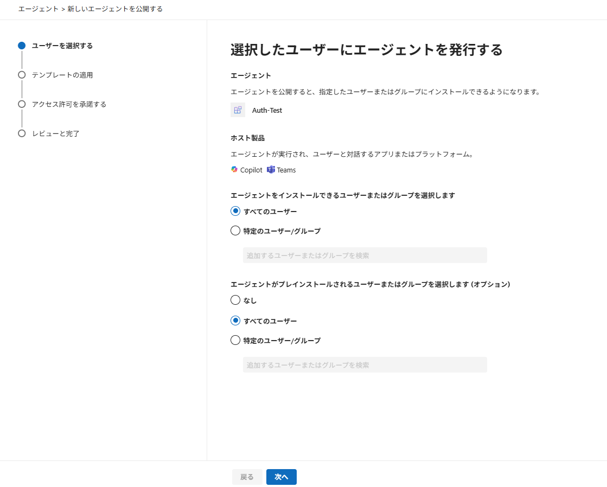
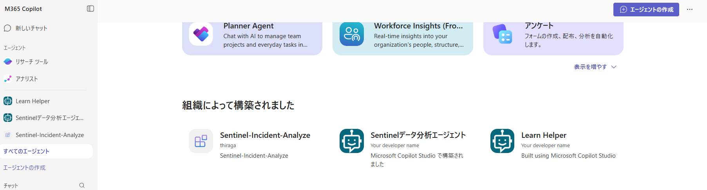
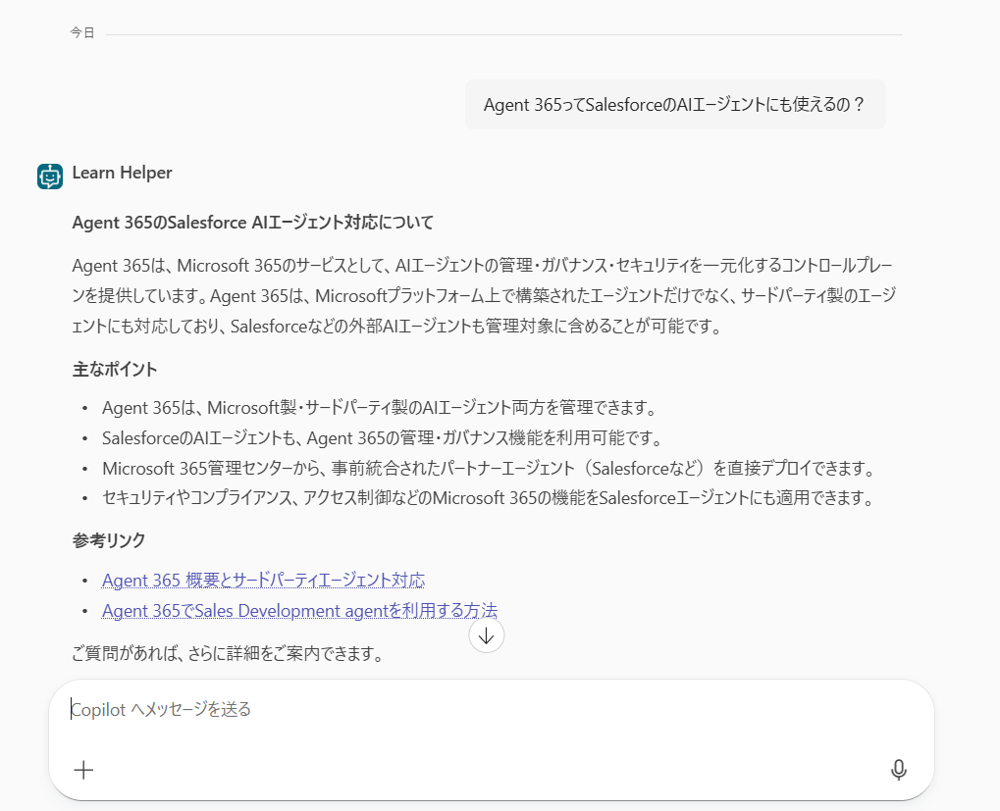

# 第2部 A：承認と観測データ作成（Copilot Studio）｜AI 管理者

[第1部 A](./part1a-copilot-studio.md) で Copilot Studio から**組織に申請**したエージェントを、管理者が承認して Teams / Microsoft 365 Copilot で使えるようにし、実際に動かして観測データを作るまで。ここまで済ませると、この後の **[Observe](./part2-2-observe.md) → [Govern](./part2-3-govern.md) → [Secure](./part2-4-secure.md)** の画面にデータが出るようになる。

> ⚠️ Microsoft Agent 365 / Copilot Studio は Preview を多く含む。UI 名やメニュー位置は変わり得るので、詰まったら Microsoft Learn で最新を確認すること。

**目次**

- [1. 承認して「管理下」に置く](#1-承認して管理下に置く)
- [2. エージェントを実際に動かす（観測データを作る）](#2-エージェントを実際に動かす観測データを作る)

## 1. 承認して「管理下」に置く

Copilot Studio から「組織に表示」を申請したエージェントは、[Microsoft 365 管理センター](https://admin.microsoft.com/)（Copilot Control System）の **Requests（申請）** に現れる。管理者が承認して初めて、組織のユーザーが使える。

### 1-1. 申請されたエージェントを承認する（Requests → Publish）

|  |
|:-:|

1. [Microsoft 365 管理センター](https://admin.microsoft.com/) にサインイン
2. **Agents › All agents › Requests** を開き、Copilot Studio から申請されたエージェントを確認
3. 対象を開き、詳細を確認したうえで **ストアに公開** 
4. ウィザードを進める：
   1. **ユーザを選択する** — インストール可能なユーザー（All users / 特定）を選択
   2. **テンプレートの適用** — ポリシーテンプレート（既定 / カスタム）を選ぶ（下の注記参照）
   3. **アクセス許可を承諾する** — エージェントが要求する権限を確認し、必要なら管理者同意。このエージェントでは不要。
   4. **公開**

> **テンプレートの適用の設定には「事前準備」が必要（重要）**
> - **カスタムテンプレート**を使うなら**事前準備**が要る。アクセスパッケージ・カスタムセキュリティ属性も束ねられる。**フル手順**は [Govern：カスタムポリシーテンプレートを作る](./part2-3-govern.md#5-カスタムポリシーテンプレートを作る) を参照。
> - すぐ進めたいなら、まず **既定テンプレート（全エージェント用）** を選ぶ。
> - ⚠️ **テンプレートは「新規アクティブ化時のみ」適用**。**承認済みには後付けできない**（[Learn FAQ](https://learn.microsoft.com/microsoft-agent-365/admin/policy-template#select-a-template)）

承認が完了するとエージェントは組織カタログに載り、利用可能になる。

### 1-2. Teams / Copilot で使えるようにする

|  |
|:-:|

1. [Teams](https://teams.cloud.microsoft/) › **アプリ** で作成したエージェントを検索
2. **追加**（管理者が特定ユーザーへ事前インストールすることも可能）
3. Microsoft 365 Copilot でも使う設定にしていれば、Copilot のサイドバーからも呼び出せる

> エージェント作成の反映は非同期。承認・インストール後、Teams 検索に出るまで数分〜数時間かかることがある。

## 2. エージェントを実際に動かす（観測データを作る）

**この節が [Observe](./part2-2-observe.md) 以降の前提**。Observe 以降の画面は、エージェントを一度も動かしていないと**何も表示されない**。

### 2-1. Teams / Copilot で話しかける

|  |
|:-:|

1. [Teams](https://teams.cloud.microsoft/)（または [Microsoft 365 Copilot](https://m365.cloud.microsoft/)）で、追加したエージェントを開く
2. エージェントの機能に応じた質問を送る（例：「条件付きアクセスについて教えて」など、ツールを使う質問だと後段の観測が見やすい）
3. 応答が返れば、受信・送信の両方が通っている

### 2-2. 観測データを厚くするコツ

[Observe](./part2-2-observe.md) の画面を見栄えよくするために、少し多めに動かしておく：

- **複数回**会話する → Activity / Map に件数が積み上がる
- **複数ユーザー**で使う → User ノードが増える
- ツールを使う質問を混ぜる → Tool ノードが出る

> **要件**：E7（Agent 365）＋ Global Administrator か AI Administrator。Usage / 観測はテナント **< 4,000 ユーザー**で有効。反映には数分〜十数分のタイムラグがある。

---

← 戻る：**[第1部 A：Copilot Studio で作る](./part1a-copilot-studio.md)** ｜ 次：**[第2部：Observe（観察する）](./part2-2-observe.md)** ｜ [README（概要）](../README.MD)
