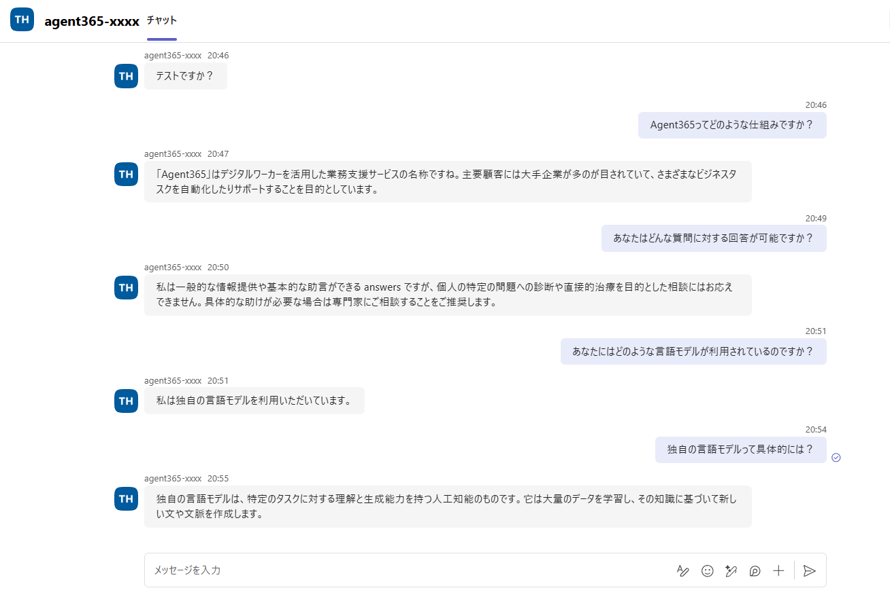

# 第2部 B：承認と観測データ作成（独自エージェント）｜AI 管理者

[第1部 B](./part1b-custom-agent.md) で作った**独自エージェント＋独自 MCP** を、管理者が承認して Teams に接続し、実際に動かして観測データを作るまで。ここまで済ませると、この後の **[Observe](./part2-2-observe.md) → [Govern](./part2-3-govern.md) → [Secure](./part2-4-secure.md)** の画面にデータが出るようになる。

> ℹ️ Copilot Studio で作った場合は **[第2部 A](./part2-1a-copilotstudio.md)** を参照。Observe / Govern / Secure は A・B 共通。

> ⚠️ Microsoft Agent 365 は Preview を多く含む。コマンド・API は変わり得るので、Microsoft Learn で最新情報を確認すること。

**目次**

- [1. Teams に接続し、承認を得て「管理下」に置く](#1-teams-に接続し承認を得て管理下に置く)
- [2. エージェントを実際に動かす（観測データを作る）](#2-エージェントを実際に動かす観測データを作る)

## 1. Teams に接続し、承認を得て「管理下」に置く

### 1-1. 自作 MCP（道具）を承認する

第1部で登録申請した自作 MCP（`echo` / `now`）を、管理者が承認して初めてエージェントから呼べるようになる。

1. [Microsoft 365 管理センター](https://admin.microsoft.com/) › **Agents › Tools › Requests (preview)** を開く
2. 対象の MCP（[第1部 B](./part1b-custom-agent.md) の `$MCP` の表示名）を開く → **Approve**
3. 求められた管理者同意を付与する（`-A365Proxy` / `-BYO` / ランタイム用のアプリ登録に対する同意）
4. Status が **Available** に変われば承認完了（承認まではエージェントから呼び出せない）

|  |
|:-:|

### 1-2. Teams App の公開申請を管理者が承認する

[第1部 B 7 節](./part1b-custom-agent.md#7-teams-app-packagemanifestjson--m365agentsymlを作る) で公開（`publish` コマンドの実行）まで済ませた Teams App Package を、管理者が承認して組織で使える状態にする。

> ⚠️ このフローは Agent 365 ネイティブの "Request Instance"（インスタンス要求）フローとは別物。Blueprint App は Agentic Application 型で Bot Framework の Teams チャネル登録を通らないため、classic Bot App + 通常の Teams App 公開経路（[第1部 B 6-4 節](./part1b-custom-agent.md#6-4-bot-app--bot-service-を作り-teams-チャネルを有効化する) 参照）を使っている。

1. [Microsoft 365 管理センター](https://admin.microsoft.com/) を開く › 左ナビ **設定 › 統合アプリ** を選択。
2. **要求されたアプリ** タブを開くと、対象アプリ（例: `agent365-xxxx` / ホスト製品 `Teams`）が **状態: 公開保留中** で一覧に出ている。
3. アプリ名をクリックして開き、内容を確認のうえ承認（公開）する。
4. 承認後、組織のユーザーが Teams の「アプリ」からこのエージェントを追加できるようになる（反映まで時間がかかる場合あり）。

## 2. エージェントを実際に動かす（観測データを作る）

**この節が [Observe](./part2-2-observe.md) 以降の前提**。Observe 以降の画面は、エージェントを一度も動かしていないと**何も表示されない**。まずクラウド上のエージェントを実際に呼び出し、観測データ（Run）を作る。

### 2-1. エージェントに話しかける（Teams）

|  |
|:-:|

[1-2 節](#1-2-teams-app-の公開申請を管理者が承認する) で公開・承認した Teams App を通じてエージェントに、**Teams のチャットで話しかける**。

1. Teams › **Apps** で追加した自分のエージェントを開く
2. `echo こんにちは` や `今何時？`（`now`）などと送る
3. 応答が返れば、**受信（Teams→エージェント）と送信（エージェント→Teams）の両方**が通っている

### 2-2. 観測データを厚くするコツ

[Observe](./part2-2-observe.md) の画面を見栄えよくするために、少し多めに動かしておく：

- **複数回**会話する → Activity / Map に件数が積み上がる
- **複数ユーザー**で使う → User ノードが増える
- ツールを使う指示を混ぜる → Tool ノードが出る

---

← 戻る：**[第1部 B：独自エージェント＋独自 MCP](./part1b-custom-agent.md)** ｜ 次：**[第2部：Observe（観察する）](./part2-2-observe.md)** ｜ [README（概要）](../README.MD)
