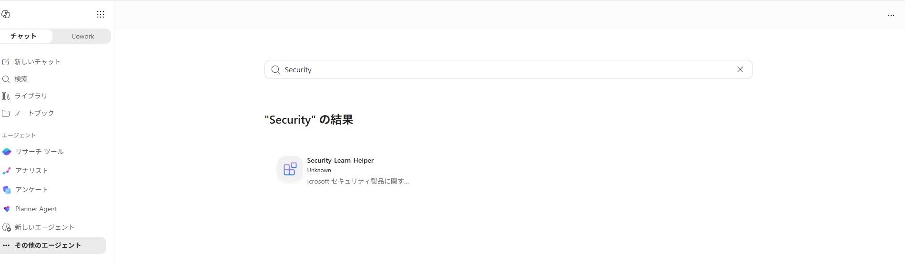

# 第2部 B：承認と観測データ作成（Microsoft Foundry）｜AI 管理者

[第1部 B](./part1b-foundry.md) で Foundry ポータルから **Autopilot として公開申請**したエージェントを、管理者が承認して Microsoft 365 Copilot で使えるようにし、実際に動かして観測データを作るまで。ここまで済ませると、この後の **[Observe](./part2-2-observe.md) → [Govern](./part2-3-govern.md) → [Secure](./part2-4-secure.md)** の画面にデータが出るようになる。

> ⚠️ Microsoft Agent 365 / Foundry は Preview を多く含む。コマンド・API は変わり得るので、Microsoft Learn で最新情報を確認すること。

**目次**

- [1. 承認して「管理下」に置く](#1-承認して管理下に置く)
- [2. エージェントを実際に動かす（観測データを作る）](#2-エージェントを実際に動かす観測データを作る)

## 1. 承認して「管理下」に置く

Foundry から Autopilot として公開申請されたエージェントは、Agent 365 側に **Blueprint**（承認待ちのエージェント登録要求）として現れる。

### 1-1. 申請されたエージェントを承認する

1. [Microsoft 365 管理センター](https://admin.microsoft.com/) にサインイン
2. **エージェント › すべてのエージェント › リクエスト** を開き、Foundry から申請された Blueprint を確認
3. 対象を開き、詳細（プロンプト、要求する権限、接続先ツールなど）を確認したうえで承認する
4. ウィザードが表示される場合は、**ユーザーの選択 → テンプレートの適用 → 権限の承諾 → 公開** を進める

承認が完了すると、Agent 365 の **レジストリ**にエージェントが載る。

### 1-2. Microsoft 365 Copilot で使えるようにする

|  |
|:-:|

1. [Microsoft 365 Copilot](https://m365.cloud.microsoft/chat) を開part2-1b-01-copilot-agent.png)く
2. サイドバーの **エージェント** から作成したエージェント名を探す
3. 見つからない場合は、承認・反映が非同期のため数分〜数時間待ってから再確認する

## 2. エージェントを実際に動かす（観測データを作る）

**この節が [Observe](./part2-2-observe.md) 以降の前提**。エージェントを一度も動かしていないと、Observe 以降の画面には何も表示されない。

### 2-1. Microsoft 365 Copilot で話しかける

1. Microsoft 365 Copilot で、追加したエージェントを開く
2. Bing Grounding を使う質問（例：「Agent 365 ってどのような仕組みですか？」）と、Microsoft Sentinel MCP を使う質問（例：「直近のインシデントを教えて」）の両方を送る
3. 応答が返れば、モデル呼び出しとツール呼び出しの両方が観測データに残る

### 2-2. 観測データを厚くするコツ

- **複数回**会話する → Activity に件数が積み上がる
- **複数ユーザー**で使う → User ノードが増える
- Bing Grounding と Sentinel MCP の**両方**を使う質問を混ぜる → Tool ノードが複数出る

---

← 戻る：**[第1部 B：Microsoft Foundry で作る](./part1b-foundry.md)** ｜ 次：**[第2部：Observe（観察する）](./part2-2-observe.md)** ｜ [README（概要）](../README.MD)
