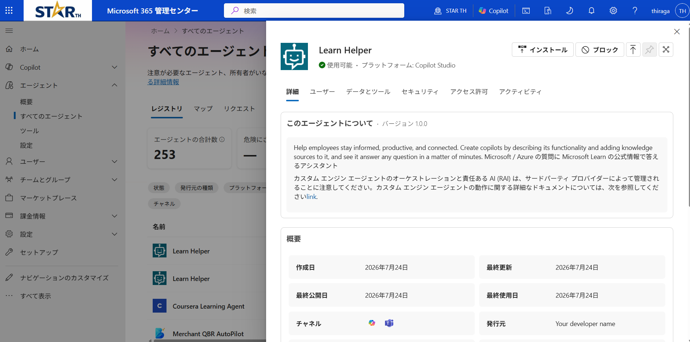
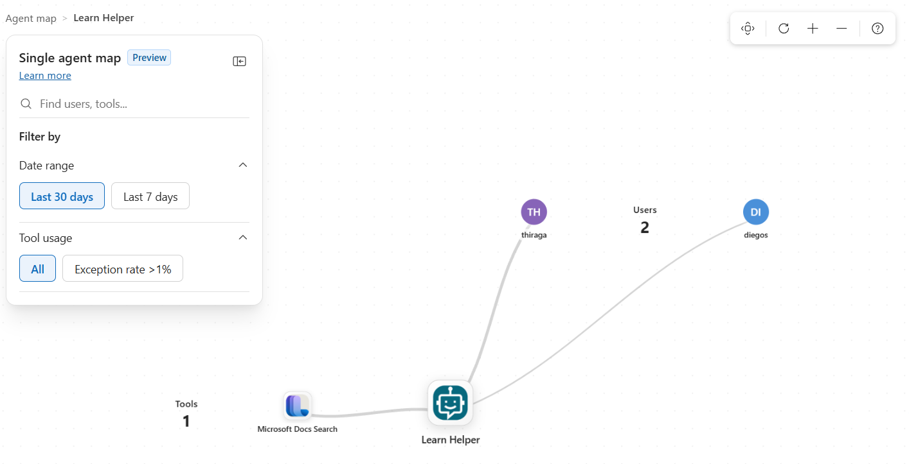

# 第2部：Observe（観察する）｜AI 管理者

Agent 365 の 3 本柱の 1 つ目。一元レジストリで「組織にどんなエージェントがいて、何をしているか」を可視化する。

>**前提**：先にエージェントを動かして観測データを作っておくこと。未実行でもRegistryの静的情報は表示されるが、ActivityやMapの実行関係は空になる。CルートではTeams直呼びとCopilot Studio経由のA2A呼び出しを両方実行しておく。

> ⚠️ Microsoft Agent 365 / Copilot Studio は Preview を多く含む。UI 名やメニュー位置は変わり得るので、詰まったら Microsoft Learn で最新を確認すること。

**目次**

- [第2部：Observe（観察する）｜AI 管理者](#第2部observe観察するai-管理者)
  - [1. Agent Registry からエージェントの詳細を確認する](#1-agent-registry-からエージェントの詳細を確認する)
  - [2. Single Agent Map で可視化する](#2-single-agent-map-で可視化する)
  - [3. アクティビティを複数のツールから確認](#3-アクティビティを複数のツールから確認)
  - [4. GSA Traffic logs で A2A 通信を確認する](#4-gsa-traffic-logs-で-a2a-通信を確認する)
  - [付録. Registry Sync（外部プラットフォームの取り込み）](#付録-registry-sync外部プラットフォームの取り込み)

## 1. Agent Registry からエージェントの詳細を確認する

|  |
|:-:| 

**[Microsoft 365 管理センター](https://admin.microsoft.com/) › Agents › All agents › Registry** で確認対象のエージェントを選択し、組織に存在する AI エージェントの詳細を確認する。

| タブ | 見るもの |
|------|---------|
| **Details** | Publisher type / Owner / Entra agent ID / Channel |
| **Users** | 利用ユーザー |
| **Data & tools** | Capabilities / Knowledge / Tools（利用している MCP はここに表示される） |
| **Security** | Microsoft Purview（活動監視・機密データ保護）＋ Microsoft Entra（ID 保護・Agent ID）。右上に **Block** |
| **Permissions** | 付与権限（Granted / Delegated） |
| **Activity** | Active users / Sessions / Exceptions と時系列グラフ |

## 2. Single Agent Map で可視化する

|  |
|:-:| 

観測データが、ツール ↔ エージェント ↔ ユーザー の関係図として描かれる。

1. **[Microsoft 365 管理センター](https://admin.microsoft.com/) › Agents › All Agents › Map**
2. **観測データを仕込んだ**エージェントを選択 
3. **All connections** を選択 → **Single Agent Map** が開く

> **User 名がハッシュ文字列で匿名化される場合**
> 組織設定「**レポートで、ユーザー、グループ、サイトの名前を非表示にする**」が有効だと、ユーザー名が MD5 ハッシュで匿名化される。実名に戻すには、Global Administrator が [Microsoft 365 管理センター](https://admin.microsoft.com/) › **設定 › 組織設定 › サービス › レポート** で当該チェックを外して保存


## 3. アクティビティを複数のツールから確認

エージェントの動作記録は、複数ポータルにそれぞれの側面で記録される。これによって、 IT 管理者やセキュリティ管理者等の役割が異なる担当者が各々の目的に沿ったツールで運用を行うことができる。

**(1) M365 管理センターで「件数」を確認（メトリクス）**

|  |
|:-:|

- [Microsoft 365 管理センター](https://admin.microsoft.com/) › **Agents › All agents › 対象 › Activity**
- ここで見えるのは「実行があった」という**メトリクス（件数）** で、対話の中身は見えない
  
**(2) Entra サインインログで「誰が利用したか」を確認（ログ）**

 |  |
|:-:| 

- [Entra 管理センター](https://entra.microsoft.com/) › **Entra ID › Agents › Agent identities › 対象 › Activity › Sign-in logs**
- 「何を話したか」ではなく「**いつ・どの ID として認証されたか**」のログ
- エージェントが**ユーザーに代わって（委任/OBO）**動いた実行では、**どのユーザーのために動いたか**（対象ユーザー）も記録される。CルートのS2S実行はアプリケーション権限で動くため、同じユーザー情報を期待しない

**(3) Purview Activity explorer で「対話の中身」を確認**

|  |
|:-:| 

- [Microsoft Purview ポータル](https://purview.microsoft.com/) › **DSPM › 発見 › アクティビティエクスプローラー › AI アクティビティ**
- 特定のレコードを選択し、**Prompt / Response** でユーザが送信した実際のプロンプトとレスポンスを確認
- Prompt / Responseの表示には対象AIアプリの収集設定、ライセンス、権限が必要。独自S2SエージェントはSDK計装だけで必ず本文収集されるわけではない

**(4) Defender Advanced Hunting で横断照合（実行トレース）**

- [Microsoft Defender ポータル](https://security.microsoft.com/) › **調査と対応 › 追求 › 高度な追求** で、AI Agent 活動について横断的にログ分析する

- 直近レコード確認し、そのテナントのログを確認する
  ```kusto
  CloudAppEvents
  | where Timestamp > ago(1d)
  | where ActionType in ("InvokeAgent", "InferenceCall", "ExecuteToolBySDK", "ExecuteToolByGateway", "ExecuteToolByMCPServer")
  | project Timestamp, ActionType, RawEventData
  | take 20
  ```

- 過去1日間の操作ログを抽出して一覧表示
  ```kusto
  CloudAppEvents
  | where Timestamp > ago(1d)
  | where ActionType in ("InvokeAgent", "InferenceCall", "ExecuteToolBySDK", "ExecuteToolByGateway", "ExecuteToolByMCPServer")
  | extend RuntimeAgentId = tostring(RawEventData.recipient.agenticAppId), ConversationId = tostring(RawEventData.ConversationId)
  | project Timestamp, ActionType, RuntimeAgentId, ConversationId
  | order by Timestamp desc
  ```

- 特定の `ConversationId` だけに絞り、特定のオペレーションについて実行内容を確認：

  ```kusto
  CloudAppEvents
  | where tostring(RawEventData.ConversationId) == "<控えた ConversationId>"
  | project Timestamp, ActionType, RawEventData
  | order by Timestamp asc
  ```


## 4. GSA Traffic logs で A2A 通信を確認する

Copilot Studioから独自エージェントへ送られたA2A通信がGlobal Secure Accessを通過したか、ネットワーク観点で確認する。

この確認は、対象Power Platform環境で **Global Secure Access for Agents** が有効な場合のみ実施する。

1. [第2部C](./part2-1c-custom.md#3-3-a2a-委譲をテストする)のA2A委譲を実行する
2. [Microsoft Entra管理センター](https://entra.microsoft.com/)で **Global Secure Access > Monitor > Traffic logs**を開く
3. 宛先FQDN `<APP>.azurewebsites.net`と実行時刻で絞る（FQDNに`https://`は含めない）
4. 該当ログが1件以上あり、Actionが`Allowed`、HTTP statusが成功系であることを確認する

## 付録. Registry Sync（外部プラットフォームの取り込み）

**Amazon Bedrock・Google Vertex AI・Salesforce Agentforce・Databricks Genie** など Microsoft 外のプラットフォームで作ったエージェントは、**Registry Sync** でレジストリに取り込める。

1. 管理センター › **Agents › All Agents** の **Registry sync**  › **開始**
2. **+ プラットフォームを接続する** → 接続名・説明・プラットフォーム・リージョン・認証情報を入力 → **認証を確認** → **保存**
3. **Sync agents** で同期。以後は接続ごとに同期状況・最終同期・エラーを確認できる

> **Sync だけでは「一覧管理」しかできない（重要）**
> Registry Sync が取り込むのは**エージェントの在庫（メタデータ）と、各プラットフォーム API が許す管理アクション**まで。**Observe のテレメトリ（Activity の件数・Single Agent Map・Purview の対話本文・Defender の実行トレース）は取得できない**。テレメトリを得るには、そのエージェントを **Agent 365 SDK（Microsoft OpenTelemetry Distro）で計装**するか、Copilot Studio / Foundry のように**自動でテレメトリを送る**構成にする必要がある。
---

← 戻る：**[第2部 A：Copilot Studio](./part2-1a-copilotstudio.md)** ／ **[第2部 B：Microsoft Foundry](./part2-1b-foundry.md)** ／ **[第2部 C：独自エージェント](./part2-1c-custom.md)** ｜ 次：**[第2部：Govern（管理）](./part2-3-govern.md)** ｜ [README（概要）](../README.MD)
