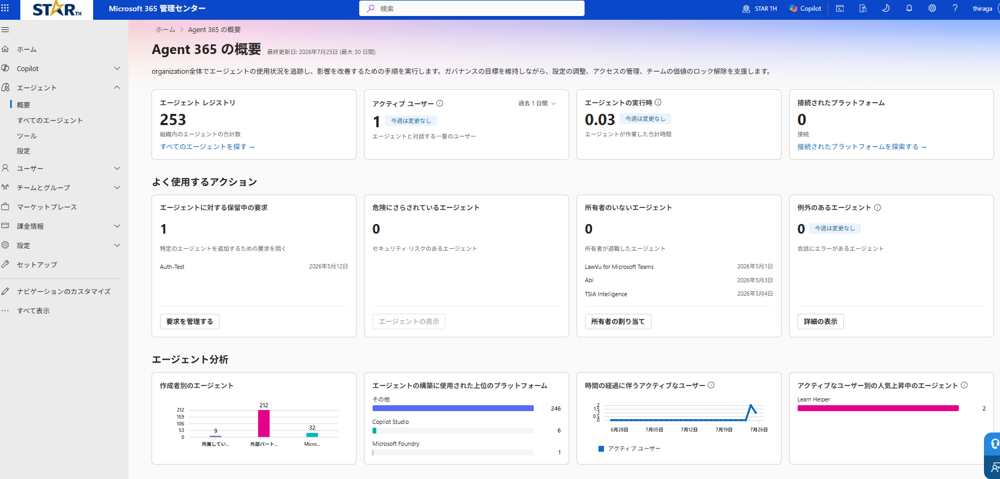
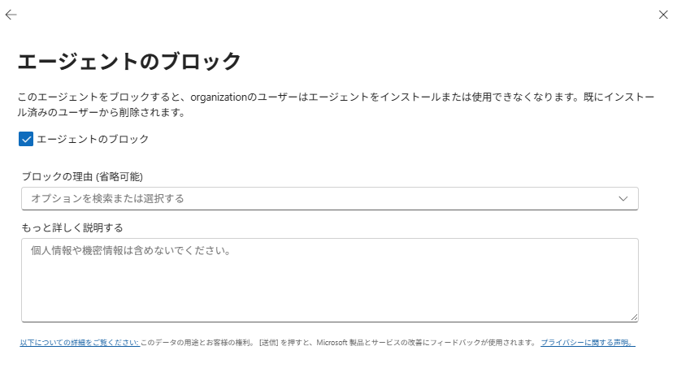
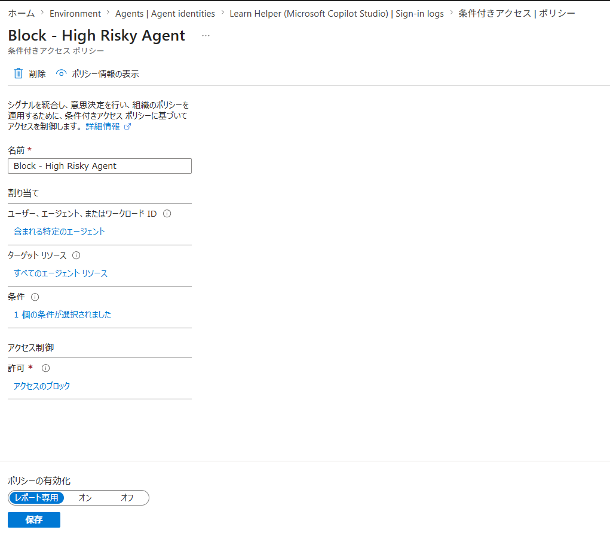
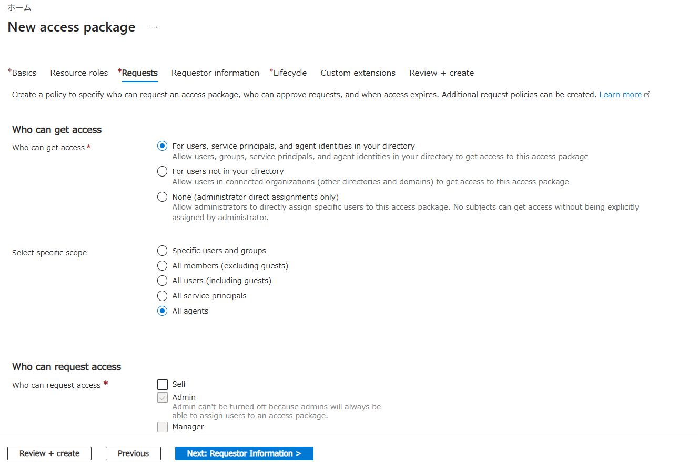
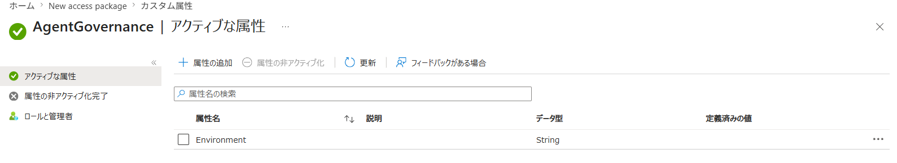
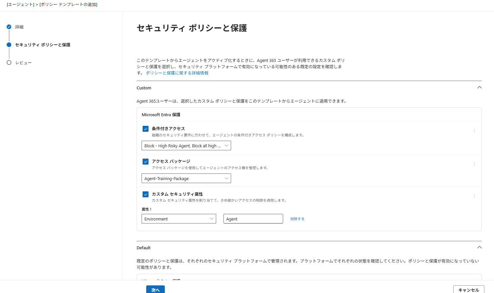

# 第2部：Govern（管理）｜AI 管理者

Agent 365 の 3 本柱の 2 つ目。ライフサイクル管理と一貫したガードレール。

> ⚠️ Microsoft Agent 365 / Copilot Studio は Preview を多く含む。UI 名やメニュー位置は変わり得るので、詰まったら Microsoft Learn で最新を確認すること。

**目次**

- [第2部：Govern（管理）｜AI 管理者](#第2部govern管理ai-管理者)
  - [1. ガバナンスの前提（Agent ID が無いと統制は効かない）](#1-ガバナンスの前提agent-id-が無いと統制は効かない)
  - [2. 統制対象を棚卸しする](#2-統制対象を棚卸しする)
  - [3. Block（Kill Switch）— 構成保持のまま即時停止](#3-blockkill-switch-構成保持のまま即時停止)
  - [4. 削除（リタイア）](#4-削除リタイア)
  - [5. カスタムポリシーテンプレートを作る](#5-カスタムポリシーテンプレートを作る)
    - [5-1. Entra で 3 種のポリシーを作成](#5-1-entra-で-3-種のポリシーを作成)
    - [5-2. M365 管理センターでテンプレートを作る](#5-2-m365-管理センターでテンプレートを作る)
  - [付録. LAB 未実施メニューの概念](#付録-lab-未実施メニューの概念)

## 1. ガバナンスの前提（Agent ID が無いと統制は効かない）

「**見えること ≠ 統制できること**」である

- **Agent ID を主体に持たない**エンティティ（レジストリ同期のみ／素の Entra アプリ登録）は、**一覧には見えても統制できない**

## 2. 統制対象を棚卸しする

|  |
|:-:|

まず「どのエージェントを統制するか」を絞る。KQL は不要で、[Microsoft 365 管理センター](https://admin.microsoft.com/) の画面で一覧・フィルタできる。

1. **エージェント › すべてのエージェント › レジストリ** で全エージェントを一覧
2. **状態 / 発行元の種類 / プラットフォーム / チャネル** のフィルタで対象を絞る
3. **エージェント › 概要 › よく使用するアクション** の **所有者のいないエージェント** / **危険にさらされているエージェント** などから、要対応のエージェントを確認する
4. 必要なら **Export** で一覧を Excel / CSV に出し、棚卸し記録にする

> 補足：一括処理・自動化したい場合は [Microsoft Defender ポータル](https://security.microsoft.com/) › Advanced hunting の [`AgentsInfo`](https://learn.microsoft.com/ja-jp/defender-xdr/advanced-hunting-agentsinfo-table) テーブル等を KQL で引く方法もある

## 3. Block（Kill Switch）— 構成保持のまま即時停止

|  |
|:-:|

Block には 2 つの粒度がある。**本節の手順（下記 1〜4）はエージェント全体の Block**。インスタンス単位の Block は、AI Teammate エージェントにのみ存在するため本教材では対象外。

| 粒度 | どこで | 効果 |
|------|--------|------|
| **エージェント全体**（本節の手順） | Agents › All agents › 対象 › **Block** | 組織全体で利用不可。全ユーザーから外れ、インストール済みのユーザーからも削除される。複数インスタンスがあれば全 instance に波及 |
| **インスタンス単位** | エージェント詳細の **Instances** タブ › 対象 instance › **Block** | その instance だけ停止（実行中の動作も止まる）。**Instances タブは AI Teammate エージェントにのみ表示**されるため、本教材では対象外 |

1. [Microsoft 365 管理センター](https://admin.microsoft.com/) › **Agents › All agents** で対象を開く（`Available`）→ 右上 **Block**
2. **エージェントのブロック** にチェック、任意で 理由など を記入 → **保存**
3. ステータスが **ブロック済み** に。
4. 解除は **ブロックを解除** ボタンから実行する

> **「Block ＝ ID を止める」であって「プロセスを止める」ではない（重要）**：Block が止めるのは、エージェントの **Entra Agent ID による認証（トークンの発行）**。エージェントの中身（サーバープロセス）まで止まるかは、**外部（LLM や MCP）を呼ぶときに何の資格情報を使っているか**による。
> - エージェントが **Agent ID のトークンで外部を呼ぶ**構成なら、Block でその呼び出しも失敗する（＝キルスイッチ成立）。
> - エージェントが **Agent ID とは別の資格情報**（アプリ自身の ID や API キーなど）で外部を呼ぶ構成なら、**ID は止まってもプロセスは動き続ける** ため、完全に止めるにはホスト側（例：App Service を停止）で止める必要がある。

## 4. 削除（リタイア）

Block は「一時停止」。完全に削除したい場合は、ルートに応じた手順でエージェント本体（と、自前ホストなら Azure リソースまで）消す。

| | Block（無効化） | Delete（削除） |
|--|----------------|----------------|
| 何が起きる | 認証・トークン発行を止める。オブジェクトは残る | Blueprint / Agent ID を消す（関連する Entra オブジェクトも削除） |
| 構成・データ | 保持（Unblock で復帰） | 失われる（30 日は論理削除で復元可） |

片付けはルートによって異なる。

**パターン A（Copilot Studio）**：完全に消すには [Copilot Studio](https://copilotstudio.microsoft.com/) で対象エージェントを開き **削除（Delete）** する。

**パターン B（Microsoft Foundry）**：[Foundry ポータル](https://ai.azure.com/) で対象の Prompt agent を開き **削除（Delete）** する。

**パターン C（自前ホスト）**：

1. 作業ディレクトリで `a365 cleanup`（**破壊的**。config の Blueprint 配下＝Blueprint と Agent ID、関連する Entra アプリ登録を一括削除）
2. 取り残し確認：`az ad app list --display-name "<blueprint名>" -o table` → 残っていれば `az ad app delete --id <appId>`
3. Azure リソースを削除：App Service / Functions / ACR / ストレージをまとめて `az group delete -n $RG`

## 5. カスタムポリシーテンプレートを作る

テンプレートは、複数のポリシーを束ねてエージェントへ**一括適用するガバナンスの仕組み**。承認タイミングで「テンプレートの適用」で選べる**カスタムテンプレート**は、ここで事前に作る。テンプレートでは **条件付きアクセス・アクセスパッケージ・カスタムセキュリティ属性** の 3 種の Entra ポリシーを束ねられる。

> **用語解説**
> - **（ポリシー）テンプレート**：複数の Entra ポリシー（条件付きアクセス・アクセスパッケージ・カスタムセキュリティ属性）を **1 つに束ねた“テンプレート”**。エージェントの承認（アクティブ化）時に、束ねたポリシーがまとめて適用される。
> - **適用タイミング**：テンプレートは**新規アクティブ化時のみ**適用されるため、承認済みのエージェントに対しては、Entra からの個別割り当てが必要
 
### 5-1. Entra で 3 種のポリシーを作成

テンプレートに束ねる前提として、対象ポリシーを先に作る。ここでは**影響の少ない具体例**で 1 つずつ作る（必要なものだけでよい）。いずれも [Microsoft Entra 管理センター](https://entra.microsoft.com/) で行う。

**(a) 条件付きアクセス**

|  |
|:-:|

条件付きアクセスは「**どのエージェント ID が・どんな条件のとき・アクセスを許すか／止めるか**」を決めるルール。ここでは「**エージェントのリスクが高いときだけトークン発行をブロックする**」ルールを、影響の出ない **Report-only**（記録のみ・実際には止めない）で作る。

> **用語解説**
> - **条件付きアクセス**：サインインのたびに「**誰が・どんな状況か**」を見て **許可／ブロック** を自動判定するアクセス制御の仕組み
> - **エージェント リスク**：エージェントの振る舞いから算出される危険度

1. [Microsoft Entra 管理センター](https://entra.microsoft.com/) › **Entra ID › 条件付きアクセス** で新規ポリシー作成
2. 次のように構成（例「Block - High Risky Agent」）：

   | 設定 | 値 | 意味（自然言語） |
   |------|----|------|
   | ユーザー、エージェント、またはワークロード ID | **Select agents** で対象の Agent ID を 1 つ以上 | このポリシーを効かせる相手（今回作ったエージェント）を指定する |
   | ターゲット リソース | All agent resources | エージェントが使うすべてのリソースへのアクセスを対象にする |
   | 条件 | **エージェント リスク = 高** | リスクが「高」と判定されたときだけこのルールを効かせる |
   | 許可 | **アクセスのブロック** | 条件に当てはまったらトークンを発行せず遮断する |
   | ポリシーの有効化 | **Report-only** | まず記録のみ（実際には止めない）。影響を確認してから**オン**に切り替える |

> このポリシーは「**リスクが高いエージェントだけ自動で締め出す**」セーフティネット。Report-only の間は実際には止めず、サインインログに「**もしオンなら遮断していた（Would block）**」とだけ残る。影響が想定内なら **オン** に切り替える。
> 出典: [エージェント向け条件付きアクセス](https://learn.microsoft.com/entra/identity/conditional-access/agent-id)

**(b) アクセスパッケージ**

|  |
|:-:|

テスト目的で「エージェントに空のグループのメンバー権を渡す」構成。特定の記載がない場所はデフォルトの設定で進める。

> **用語解説**
> - **セキュリティ グループ**：メンバーをまとめる入れ物。グループに権限を付ければメンバー全員へ一括で効く（今回は空＝権限なし）。
> - **カタログ**：配れるリソース（グループ等）をまとめた「カタログ」。アクセス パッケージではこのカタログの中にあるものだけを指定できる。
> - **アクセス パッケージ**：「誰が・何を・どう受け取れるか」を 1 つにまとめた“権限セット”。エージェントが要求すると、束ねたリソース（今回はグループのメンバー権）が付与される。

1. **準備**：[Microsoft Entra 管理センター](https://entra.microsoft.com/) › **Entra ID › グループ › 新しいグループ** で空のセキュリティ グループ（例 `Agent-Training-Group`）を作る
2. **カタログを作る**：**ID ガバナンス › エンタイトルメント管理 › カタログ › + 新しいカタログ**（例 `Agent-Training-Catalog`）
3. **カタログにリソースを追加**：作ったカタログ › **リソース › + リソースの追加 › グループとチーム** で `Agent-Training-Group` を追加
4. **アクセス パッケージを作る**：**エンタイトルメント管理 › アクセス パッケージ › + 新しいアクセス パッケージ**
   - **Basics**：名前（例 `Agent-Training-Package`）／カタログ＝`Agent-Training-Catalog`
   - **Resource roles**：**+ Groups and Teams** から`Agent-Training-Group` を追加し、ロール＝**member**
   - **Requests** タブ（3 ブロックに分かれる）：
     - **Who can get access**（誰が受け取れるか）：**For users, service principals, and agent identities in your directory** を選ぶ → **Select specific scope** で **All agents** を選択（＝エージェントに配れる）
     - **Who can request access**（誰が要求できるか）：勉強用は既定の **Admin** のまま
     - **Approval**（承認）：**Require approval = No**（承認フロー無しで最短）
   - **Requestor information** / **Lifecycle** 以降は既定のまま **Create**

**(c) カスタムセキュリティ属性**

|  |
|:-:|

> **用語解説**
> - **カスタムセキュリティ属性**：Entra のオブジェクト（ユーザーやエージェント ID）に、組織独自の「タグ（キー＝値）」を付ける仕組み。本番・開発環境の使い分けや認証方式のタグ付けなど、様座な用途で利用可能。

1. **属性セットを作る**：[Microsoft Entra 管理センター](https://entra.microsoft.com/) › **Entra ID › カスタム セキュリティ属性 › 属性セットを追加する**（例 名前 `AgentGovernance`）
2. **属性（キー）を定義する**：作った属性セットを開き **属性の追加**（例 名前 `Environment`／データ型 `文字列`）。

### 5-2. M365 管理センターでテンプレートを作る

|  |
|:-:|

1. [Microsoft 365 管理センター](https://admin.microsoft.com/) › **エージェント › 設定 › 新しいポリシーテンプレートを追加**
2. 次を入力する：
   - **テンプレート名**（例 `Agent-Training-Template`）
   - **説明**（例 `トレーニング用：条件付きアクセス／アクセスパッケージ／環境タグを束ねたテンプレート`）
   - **「エージェントの種類**：独自の ID を持たないエージェント
3. **次へ** ：
   - **条件付きアクセス**：`Block - High Risky Agent`
   - **アクセスパッケージ**：`Agent-Training-Package`
   - **カスタムセキュリティ属性**：属性 `Environment` を選び、**エージェントへ割り当てる値 `Agent` をここで指定**する（テンプレートを当てたエージェントに `Environment = Agent` が付与される）
4. 内容を確認して **テンプレートを保存**

## 付録. LAB 未実施メニューの概念

[Microsoft 365 管理センター](https://admin.microsoft.com/) の **エージェント › 設定** には、本 LAB で扱った以外にも、テナント全体に効く組織レベル設定がある。

| メニュー | 主なユースケース | 設定による効果・ポイント |
|---|---|---|
| **エージェント管理ルール**| 全社に Microsoft 製エージェントをまとめて配布したい／退職者が残した所有者不在エージェントを整理したい | 条件に合うエージェントへ一括アクションを実行する。現状 (1) Microsoft 製エージェントを全ユーザーへ一括インストール、(2) 所有者不在エージェントを元所有者の上司（Entra 階層）へ一括再割り当て、の 2 種。(2) は **Microsoft 365 Copilot Agent Builder 製のみ**対象 |
| **許可されているエージェントの種類** | ストアに出す／出さないエージェントを出所で絞りたい（外部製を禁止したい等） | **Microsoft 製／自組織製／外部発行元製** の 3 トグルで、ストアでの閲覧・インストール可否を制御する。 |
| **ユーザー アクセス** | 一部のユーザー／グループにだけエージェント利用を許したい | **All users（既定）／No users／Specific users・groups** の 3 択。Registry にインストール権があっても、ここで許可した相手だけが実際に使える。 |
| **共有**| エージェントの社内共有を誰に・どの方法で許すか制御したい | **All／No／Specific users** で共有可否を制御する。**対象は Microsoft 365 Copilot Agent Builder 製エージェントのみ** |

> 出典：[Agent settings in Microsoft 365 admin center](https://learn.microsoft.com/microsoft-365/admin/manage/agent-settings)

---

← 戻る：**[第2部：Observe（観察する）](./part2-2-observe.md)** ｜ 次：**[第2部：Secure（保護）](./part2-4-secure.md)** ｜ [README（概要）](../README.MD)
