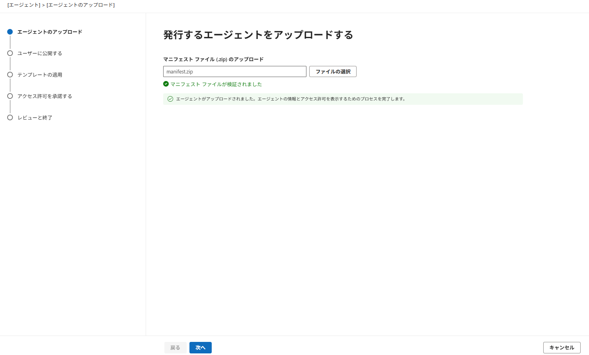
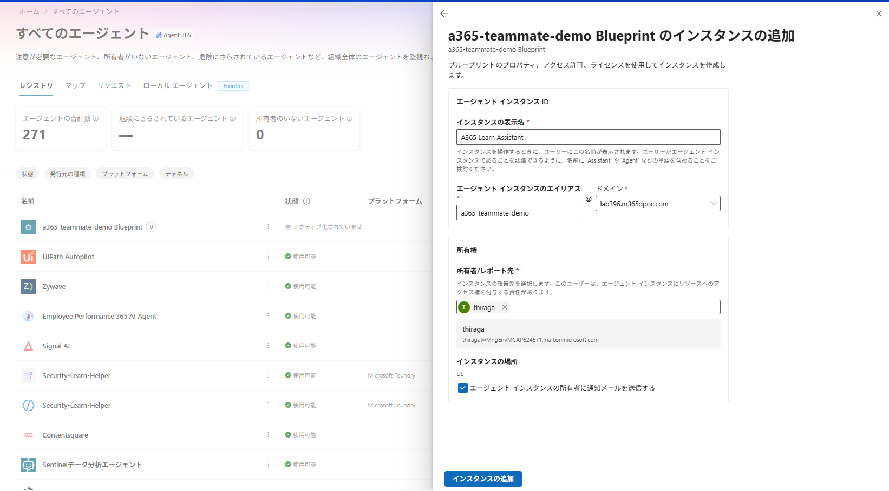

# 第3部 A：AI Teammate を作る（開発者）

**独自の M365 ユーザー ID（UPN・メールボックス・Teams 在席・組織図エントリ）を持つ AI Teammate** を作る。頭脳は **Microsoft Foundry のクラウドモデル**を直接呼ぶ。

**S2S エージェント**は「アプリとして」動いたが、AI Teammate は **"人"としてふるまう**（@mention・メール・会議招待で対話できる）。

> ⚠️ Preview を多く含む。コマンド・UI・提供リージョンは変わり得るので Microsoft Learn で最新を確認すること。

**目次**

- [第3部 A：AI Teammate を作る（開発者）](#第3部-aai-teammate-を作る開発者)
  - [1. サインインを揃える](#1-サインインを揃える)
  - [2. Foundry でモデルをデプロイする（頭脳）](#2-foundry-でモデルをデプロイする頭脳)
  - [3. エージェント本体（src/ai-teammate）を用意する](#3-エージェント本体srcai-teammateを用意する)
  - [4. AI Teammate 化する（Blueprint＋独自 M365 ID）](#4-ai-teammate-化するblueprint独自-m365-id)
    - [ホスティング層を作る（必須）](#ホスティング層を作る必須)
  - [5. 公開してインスタンスを作成する](#5-公開してインスタンスを作成する)
  - [6. "人として" 動作確認する](#6-人として-動作確認する)

## 1. サインインを揃える

サインインは第1部と同様、**`az login` と Teams Toolkit の M365 サインインを同じテナントに揃える**。

```powershell
az login
m365agentstoolkit-cli account login m365
m365agentstoolkit-cli account show   # az account show と同じテナントか確認
```

## 2. Foundry でモデルをデプロイする（頭脳）

AI Teammate の思考エンジンに使うモデルを Foundry にデプロイし、**エンドポイント・API キー・デプロイ名**を控える。

1. [Foundry ポータル](https://ai.azure.com/) にサインイン。ホーム画面の下段に **API キー** と **Azure OpenAI エンドポイント**（`https://<リソース名>.openai.azure.com/openai/v1` 形式）が表示される。
2. モデルをデプロイする：ホームの **「モデルの選択」› モデルを探す** から使うモデル（例 `gpt-4.1`）を開き **デプロイ**（既定の設定でよい）。
3. 次の3つを控える（次節の `.env` に使う）：
   | 控える値 | 取得場所 |
   |---------|---------|
   | **Azure OpenAI エンドポイント**（`.../openai/v1`） | ホーム画面「Azure OpenAI エンドポイント」右のコピーアイコン |
   | **API キー** | ホーム画面「API キー」右のコピーアイコン |
   | **デプロイ名** | 「モデルを使用する › デプロイの表示」で確認 |

## 3. エージェント本体（src/ai-teammate）を用意する

**1. リポジトリを取得する**（Part 1 で clone 済みならスキップ）

```powershell
git clone https://github.com/fatman3110/Agent365-Training.git
cd Agent365-Training/src/ai-teammate
```

**2. `.env` を作る**（まず 2 節で控えた値を変数に入れ、それを `.env` に書き出す。`.env` はコミットしない）

```powershell
# 2 節で控えた値をそれぞれ貼り付ける
$BASE_URL   = "<Azure OpenAI エンドポイント>"
$API_KEY    = "<キー>"
$DEPLOYMENT = "<デプロイ名>"

# .env に書き出す
Set-Content .env @"
AZURE_OPENAI_BASE_URL=$BASE_URL
AZURE_OPENAI_API_KEY=$API_KEY
AZURE_OPENAI_DEPLOYMENT=$DEPLOYMENT
"@
```

## 4. AI Teammate 化する（Blueprint＋独自 M365 ID）

第1部C と同じ **スキル駆動**で進める。`src/ai-teammate` を開いた状態で、**AI チャット** に次を指示する：

```text
src/ai-teammate のこのエージェントを Microsoft Agent 365 の AI Teammate にして。
独自の M365 ユーザー ID（UPN・メールボックス・Teams 在席）を持たせ、頭脳は .env の AZURE_OPENAI_* で Foundry のクラウドモデルを使う。
capabilities は AI Teammate、認証は agentic-user（--authmode は付けない）でセットアップして。
```

スキル（`a365-setup` → `make-ai-teammate`）が起動し、対話に沿って **`a365 setup all --aiteammate --m365`** を実行する。これで **Blueprint＋継承権限＋管理者同意**が作成される（`--authmode` は使わない）。

> スキルを使わず直接実行してもよい（結果は同じ）：
> ```powershell
> a365 setup all --aiteammate --m365 -n a365-teammate-xxxx
> ```

- 途中の `[y/N]` 承認・ブラウザ認証は画面の指示どおりに進める。
- **成功の判定**：`Setup completed successfully` が表示され、`a365.generated.config.json` に `agentBlueprintId` が入り、`.env` にテナント・観測性設定が stamp される（シークレットは gitignore 済み）。
- **⚠️ このステップではホスティング層（Teams で動く本体）は作られない**。必ず下の手順で手動作成する。

### ホスティング層を作る（必須）

`llm.py`（頭脳）だけでは Teams のメッセージを受け取れない。**本体（ホスティング層）は本リポジトリに同梱済み**。`src/ai-teammate/` の内訳：

| ファイル | 役割 |
|---------|------|
| `agent.py` | メッセージを `llm.chat_complete` に渡す AI Teammate 本体。`InvokeAgentScope`/`InferenceScope` で `invoke_agent`/`chat` のセマンティック span を生成 |
| `observability_config.py` | A365 観測性の初期化（`configure()`）。token_resolver がキャッシュ済み観測性トークンを返す |
| `turn_context_utils.py` | TurnContext から observability 用 details（agent/caller/request）を抽出 |
| `agent_interface.py` | 本体の抽象基底 |
| `host_agent_server.py` | aiohttp サーバー＋A365 ルーティング（`/api/messages`・`/api/health`）。観測性トークンを exchange・cache |
| `token_cache.py` | 観測トークンのキャッシュ（host が保存・exporter が取得）|
| `main.py` | 起動エントリ（`python main.py`）|
| `Dockerfile` | App Service デプロイ用（単一コンテナ・ Ollama sidecar 無し）|
| `requirements.txt` | 頭脳＋ホスティング／A365 ランタイム／観測性依存 |


## 5. 公開してインスタンスを作成する

AI Teammate は「**instance 作成**」まで行って初めて M365 で人として動く。**エンドポイント確定 → publish → 管理センターで instance 作成**の順で進める。

1. **App Service にデプロイしてエンドポイントを得る**（Part 1 未実施でも動くよう必要リソースを**新規作成**する。RG／プランなど**自分のサブスク内**のリソースは冪等に再利用される。**ただし ACR 名とアプリ名は世界で一意**——`xxxx` は必ず**自分だけのユニーク文字列**に置換すること

   ```powershell
   # --- 名前（xxxx は自分用のユニークな文字列に置換）---
   $RG   = "rg-agent365-training"          # 無ければ作成／有れば再利用
   $LOC  = "japaneast"
   $ACR  = "acragent365xxxx"                # 世界で一意・英数字のみ。xxxx を自分の値に。空き確認: az acr check-name -n <名前>
   $PLAN = "plan-agent365-teammate-xxxx"
   $APP  = "app-agent365-teammate-xxxx"     # 世界で一意

   # --- リソース作成（いずれも冪等：既存なら再利用しエラーにならない）---
   az group create -n $RG -l $LOC
   az acr create -n $ACR -g $RG --sku Basic --admin-enabled false
   az appservice plan create -n $PLAN -g $RG --is-linux --sku B2

   # カレント = src/ai-teammate。同梱 Dockerfile でイメージをビルド
   az acr build -r $ACR -t ai-teammate:latest .

   # Web アプリ（コンテナ）
   az webapp create -n $APP -g $RG -p $PLAN --deployment-container-image-name "$ACR.azurecr.io/ai-teammate:latest"

   # .env をアプリ設定に反映（AZURE_OPENAI_* / a365 setup が stamp した設定）＋待受ポート
   $settings = Get-Content ".env" | Where-Object { $_ -match '^[^#\s][^=]*=' }
   az webapp config appsettings set -n $APP -g $RG --settings $settings WEBSITES_PORT=3978

   # リリース前に観測性を強制有効化（
   az webapp config appsettings set -n $APP -g $RG --settings ENABLE_A365_OBSERVABILITY=true ENABLE_A365_OBSERVABILITY_EXPORTER=true AUTH_HANDLER_NAME=AGENTIC

   # マネージド ID を有効化し ACR からの pull 権限（AcrPull）を付与
   az webapp identity assign -n $APP -g $RG
   $principalId = az webapp identity show -n $APP -g $RG --query principalId -o tsv
   $acrId = az acr show -n $ACR -g $RG --query id -o tsv
   az role assignment create --assignee $principalId --scope $acrId --role AcrPull 2>$null
   $appId = az webapp show -n $APP -g $RG --query id -o tsv
   az resource update --ids "$appId/config/web" --set properties.acrUseManagedIdentityCreds=true
   # → エンドポイント：https://$APP.azurewebsites.net/api/messages
   ```

   得たエンドポイントを blueprint に登録：
   ```powershell
   a365 setup blueprint --endpoint-only --messaging-endpoint "https://$APP.azurewebsites.net/api/messages" --m365
   ```
2. **manifest をカスタマイズして publish する**：

   `a365 publish` を実行すると `src/ai-teammate/manifest/manifest.json` が生成される。必要に応じて、manifest の内容を変更する

   | フィールド | 何を書くか | 例 |
   |-----------|-----------|-----|
   | `name.short` | 30 文字以内の表示名（"...Blueprint" のままにしない・他パートと重複しない名）| `A365 AI Teammate Demo` |
   | `name.full` | M365 に出るフルネーム | `Agent 365 AI Teammate (Foundry)` |
   | `description.short` | 80 文字以内の概要 | `Answers Microsoft/Azure questions using a Foundry cloud model.` |
   | `description.full` | 詳細な能力説明 | `It has its own M365 identity and can be @mentioned, emailed, and invited to meetings in Teams.` |
   | `developer.name` | 発行元組織名 | `Contoso` |
   | `developer.websiteUrl` / `privacyUrl` / `termsOfUseUrl` | 自組織の URL（テストなら既定のままでも可）| `https://contoso.com/privacy` |

   ```powershell
   a365 publish
   ```

   > ⚠️ `a365 publish` は**対話式**。エディタで編集・保存 → ターミナルで **Enter** で `manifest.zip` が出来る。

3. **管理センターへ手動アップロード**（`src/ai-teammate/manifest/manifest.zip` を登録）：
   1. [M365 管理センター](https://admin.microsoft.com/) を開く
   2. **エージェント › すべてのエージェント ›  3点リーダ › エージェントの追加** を選ぶ
   3. **ファイルの選択** で `manifest.zip` を選択
   5. **割り当てるユーザー**、**テンプレート**、 **アクセス許可**を設定・確認 
   7. **公開** を選ぶ

|  |
|:-:|

4. **instance を作成する**（管理センターから直接作れる・こちらが簡単）：
   1. [M365 管理センター](https://admin.cloud.microsoft/#/agents/all) › **エージェント › すべてのエージェント** で自分のエージェント（例：`a365-teammate-demo Blueprint`）を選ぶ
   2. 右に開く詳細パネル上部の **＋ インスタンスの追加** を選ぶ
   3. 表示された「**インスタンスの追加**」フォームに入力する：

      | フィールド | 何を入れるか | 例 |
      |-----------|-------------|-----|
      | **インスタンスの表示名** | Teams でユーザーに見える名前（`Assistant`/`Agent` を含めると分かりやすい）| `A365 Learn Assistant` |
      | **エージェント インスタンスのエイリアス** | エージェントのメール／UPN の **@ 前**（英数字・ハイフン）| `a365-teammate-demo` |
      | **ドメイン** | ドロップダウンから**自テナントのドメイン**を選ぶ |  |
      | **所有者/レポート先** | このエージェントの**責任者＝組織図の上司**。自分を指定 |  |
      | **所有者に通知メールを送信** | チェックのままで可 | ✓ |

   4. **エージェント ユーザー（UPN・メールボックス）が有効化**される


|  |
|:-:|

## 6. "人として" 動作確認する

インスタンス有効化後、Teams でチャット等によるやり取りを体験する：

その後、[第2部](./part2-2-observe.md) の Observe / Govern / Secure で、**独自 ID エージェント**としての見え方（アクティビティ・ガバナンス・保護）を確認する。

> [!IMPORTANT]
> **AI Teammate のアクティビティは「インスタンス」で見る**（
> M365 管理センター › **エージェント › すべてのエージェント** で、**作成したインスタンス（例 `A365 Learn Assistant`）** を開き、**アクティビティ** タブを見る。

---

← 戻る：[第3部 概要](./part3-0-overview.md)
